# RuTeR 设计方案

> **文档版本**: 2.0 &nbsp;|&nbsp; **最后更新**: 2026-03-11
>
> 本文档描述 ruter 的完整架构设计，所有内容严格对齐当前代码实现。

---

## 目录

1. [项目定义](#1-项目定义)
2. [系统架构](#2-系统架构)
3. [模块结构](#3-模块结构)
4. [核心数据模型](#4-核心数据模型)
5. [编译器输出解析](#5-编译器输出解析)
6. [Function Dispatcher 设计](#6-function-dispatcher-设计)
7. [Pre-flight Interceptors](#7-pre-flight-interceptors)
8. [Rule Patchers 设计](#8-rule-patchers-设计)
9. [LLM Patcher 设计](#9-llm-patcher-设计)
10. [Coordinator 与 Transformer](#10-coordinator-与-transformer)
11. [运行时工作流](#11-运行时工作流)
12. [CLI 与配置系统](#12-cli-与配置系统)
13. [Artifacts 可观测性体系](#13-artifacts-可观测性体系)
14. [默认约束与安全边界](#14-默认约束与安全边界)
15. [附录：联网核对来源](#15-附录联网核对来源)

---

## 1. 项目定义

### 1.1 核心目标

ruter 是一款面向 **Rust 单元测试函数代码**的**自动修复框架**。它针对 LLM 生成的 Rust 测试代码，通过解析 `rustc` 编译器 JSON 输出，采用**规则修复（Rule Patchers）为主、LLM 修复为辅**的分层策略，自动修复编译错误。

### 1.2 设计原则

| 原则 | 说明 |
|---|---|
| **测试代码专修** | 仅修改测试代码（`#[test]`、`#[cfg(test)]`、`tests/` 目录），生产代码路径严禁改写 |
| **函数级粒度** | 所有分析、修复、验证均以单个测试函数为最小操作单元 |
| **规则优先（RuleFirst）** | 编译器诊断中存在已实现规则码时，优先走规则修复路径 |
| **验证门禁（Verify Gate）** | 任何修复动作必须通过编译验证才能接纳：目标函数错误清零 + 非目标函数不引入回归 |
| **预算收敛** | LLM 修复的每个函数具有独立轮次预算（默认 3 轮），耗尽即停止 |
| **可观测性** | 每阶段均产出结构化 JSON Artifact，支持离线分析与回归验证 |

### 1.3 当前支持的错误码

| 错误码 | 类型 | Patcher 模式 |
|---|---|---|
| `E0433` | 路径未解析 | **Action Patcher** — 直接生成 FixAction |
| `E0432` | 导入未解析 | **Action Patcher** — 直接生成 FixAction |
| `E0560` | 结构体未知字段 | **Action Patcher** — 直接生成 FixAction |
| `E0599` | 方法/关联项未找到 | **Analysis Patcher** — 分析分类 + Preflight 决策 |
| `E0308` | 类型不匹配 | **Analysis Patcher** — 分析分类 + Preflight 决策 |

此外，`E0425`（找不到值/函数）和 `E0382`（移动后使用）已注册为 `ErrorCode` 枚举项，但尚未实现对应 Patcher 。

### 1.4 能力边界

- **可修复范围**：路径重写、导入修正、字段名修正、编译器建议采纳、LLM 辅助函数体改写
- **不可修复范围**：生产代码缺陷、跨 crate 依赖更新（`cargo add`）、生命周期推断、宏展开内部错误
- **降级策略**：规则 Patcher 返回空动作 → Partial Union + LLM 处理 → 预算耗尽 → 高风险场景保守注释

### 1.5 技术栈

| 类别 | 依赖 |
|---|---|
| 语言 | Rust Edition 2024 |
| AST 分析 | `syn`（full + extra-traits + visit）、`quote`、`proc-macro2`（span-locations）、`prettyplease` |
| 序列化 | `serde` + `serde_json` |
| CLI | `clap`（derive） |
| 错误处理 | `thiserror`（Lib 层）、`anyhow`（App 层） |
| 文本匹配 | `regex` |
| 文件遍历 | `walkdir` |
| 配置解析 | `toml` |
| HTTP 客户端 | `reqwest`（blocking + rustls-tls） |
| 枚举辅助 | `strum`（derive） |
| Diff 渲染 | `diff` |
| 环境变量 | `dotenvy` |

---

## 2. 系统架构

### 2.1 主流程概览

ruter 的完整修复流程分为六个阶段（Stage），通过 **Fix 模式** 一键贯通，或通过 **Step 模式** 逐步调试：

```
  Compile → Analyze → Plan → Verify → [LLM] → Apply/Summarize
```

阶段间通过结构化 Artifact（JSON 文件）传递中间状态，保证流程可中断、可回放、可审计。

### 2.2 端到端流程图

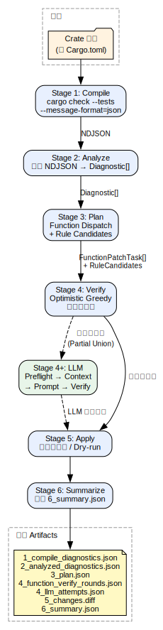

> 图表源文件：[docs/diagrams/01_pipeline.dot](docs/diagrams/01_pipeline.dot)

### 2.3 双模式执行

| 模式 | CLI 命令 | 行为 |
|---|---|---|
| **Fix** | `ruter fix <crate_path>` | 一键执行全部阶段，输出 Diff 与 Summary |
| **Step** | `ruter step <stage> <crate_path>` | 执行单个阶段，读写 Artifact 文件，用于调试与增量开发 |

Stage 枚举值：`Compile`、`Analyze`、`Plan`、`Verify`、`Apply`。

---

## 3. 模块结构

### 3.1 源码目录

```text
src/
├── main.rs                       # CLI 入口 → runtime::workflow::run()
├── lib.rs                        # 库入口，导出 5 个公共模块
│
├── core/                         # 核心数据模型（纯数据，无副作用）
│   ├── diagnostic.rs             # Diagnostic, CompilerCode, Severity
│   ├── error_code.rs             # ErrorCode 枚举（E0433/E0432/E0599/E0308/E0560/...）
│   ├── fix_action.rs             # FixAction 枚举（Insert/Replace/Delete）
│   ├── function.rs               # TestFunction, FunctionDiagnostic
│   ├── span.rs                   # SpanInfo, SpanText, SpanExpansion, Applicability
│   └── result.rs                 # RuTeRError (thiserror), Result<T>
│
├── parser/                       # 编译器输出解析
│   └── json_parser.rs            # JsonParser: NDJSON → Vec<Diagnostic>
│
├── patchers/                     # 错误码修复器
│   ├── mod.rs                    # Patcher trait 定义
│   ├── registry.rs               # PatcherRegistry（策略模式注册表）
│   ├── common/
│   │   └── compiler_suggestion.rs  # NormalizedSuggestion 公共提取层
│   ├── e0433/                    # E0433 Action Patcher（7 子模块）
│   ├── e0432/                    # E0432 Action Patcher（analyzer + patcher）
│   ├── e0560/                    # E0560 Action Patcher（analyzer + patcher）
│   ├── e0599/                    # E0599 Analysis Patcher（analyzer + patcher）
│   └── e0308/                    # E0308 Analysis Patcher（analyzer + patcher）
│
├── coordinator/                  # 补丁协调（冲突检测 + 全局候选排序）
│   ├── patch_coordinator.rs      # PatchCoordinator, GlobalCandidatePlan
│   └── patch_coordinator/        # 协调器测试子模块
│       └── tests.rs
│
├── transformer/                  # 代码变换
│   └── code_transformer.rs       # CodeTransformer: 字节级替换 + 冲突检测
│
├── cli/                          # CLI 参数定义
│   └── mod.rs                    # Cli struct (clap derive)
│
├── config.rs                     # 配置解析（CLI > ENV > TOML > 默认值）
│
├── llm/                          # LLM 修复器（私有模块，仅 main.rs 可见）
│   ├── schema.rs                 # LLM 数据结构 + 归一化
│   ├── context_builder.rs        # FunctionContextBundleV1（上下文构建）
│   ├── context_builder/          # Context builder 内部子模块
│   │   ├── budget.rs             # 上下文预算裁剪策略
│   │   ├── symbols.rs            # 符号提取与关联项收集
│   │   └── tests.rs              # context builder 单测
│   ├── prompt_builder.rs         # Prompt 契约 v2
│   ├── client.rs                 # OnlineLlmClient（reqwest + OpenAI 兼容）
│   ├── executor.rs               # 执行器入口
│   ├── handoff.rs                # LLM Handoff 数据
│   ├── io_debug.rs               # I/O 调试记录
│   ├── runtime_entry.rs          # CLI 验证桥接
│   ├── executor/                 # 执行子模块
│   │   ├── round_runner.rs       # 核心迭代循环（Preflight→Round→Budget Fallback）
│   │   ├── candidate_resolution.rs # 候选验证与动作合并
│   │   ├── attempt_history.rs    # 尝试历史追踪
│   │   ├── preflight_flow.rs     # Preflight 注释尝试
│   │   ├── verify_port.rs        # 验证接口抽象
│   │   └── workspace_ops.rs      # 临时工作空间
│   └── preflight/                # Preflight 分析器
│       ├── mod.rs                # 五维分析编排
│       ├── decision.rs           # PreflightDecision 决策逻辑
│       ├── comment_out.rs        # 注释动作生成
│       ├── e0308.rs              # E0308 分析注入
│       ├── e0432.rs              # E0432 分析注入
│       └── e0560.rs              # E0560 分析注入
│
└── runtime/                      # 运行时编排（私有模块）
    ├── artifacts.rs              # ArtifactPaths, RunSummary
    ├── reporter.rs               # 控制台彩色输出 + 日志
    ├── llm_verify_port.rs        # LLM 验证桥接实现
    ├── stages.rs                 # Stage 公共 API
    ├── workflow.rs               # Fix/Step 工作流入口
    ├── function/                 # 函数级处理
    │   ├── dispatch.rs           # FunctionDispatcher（RuleFirst 分发）
    │   ├── dispatch/             # dispatch 测试子模块
    │   │   └── tests.rs
    │   ├── index.rs              # FunctionIndex（AST 静态分析）
    │   ├── index/                # index 测试子模块
    │   │   └── tests.rs
    │   ├── low_value.rs          # LowValue 检测
    │   ├── rule_plan.rs          # 规则候选生成
    │   ├── rule_plan/            # rule_plan 测试子模块
    │   │   └── tests.rs
    │   └── verify.rs             # Optimistic Greedy 验证
    ├── stages/                   # Stage 实现
    │   ├── diagnostics.rs        # 诊断解析与路径归一化
    │   ├── run_flow.rs           # compile/analyze/plan Stage
    │   ├── verify_engine.rs      # 临时工作空间编译
    │   ├── verify_flow.rs        # 验证流程编排
    │   ├── diff.rs               # Unified Diff 渲染
    │   └── io.rs                 # 文件 I/O（备份/还原/日志）
    └── workflow/                 # 工作流实现
        ├── fix_flow.rs           # Fix 模式全自动
        ├── step_flow.rs          # Step 模式逐级
        └── common.rs             # 共享工具（Partial Plan, LLM 调度）
```

### 3.2 模块层次架构图

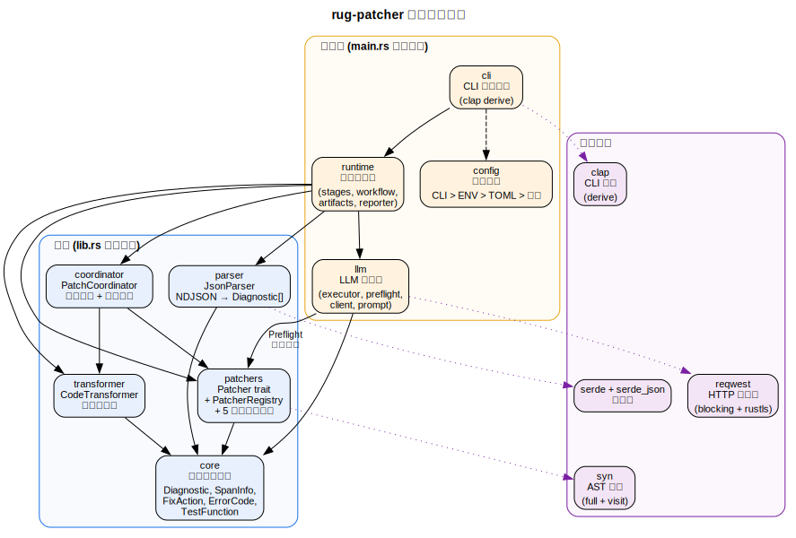

> 图表源文件：[docs/diagrams/06_module_layers.dot](docs/diagrams/06_module_layers.dot)

### 3.3 库（lib.rs）与应用（main.rs）边界

```
lib.rs 导出 5 个公共模块:
  ├── core         → 核心数据模型
  ├── parser       → 编译器输出解析器
  ├── patchers     → Patcher trait + Registry + 各错误码 Patcher
  ├── coordinator  → 补丁协调
  └── transformer  → 代码变换

main.rs 声明 4 个私有模块:
  ├── cli          → CLI 参数
  ├── config       → 配置解析
  ├── llm          → LLM 修复器
  └── runtime      → 运行时编排
```

`llm` 和 `runtime` 模块作为应用内部实现不对外暴露，保证 lib 层的 API 稳定性。

---

## 4. 核心数据模型

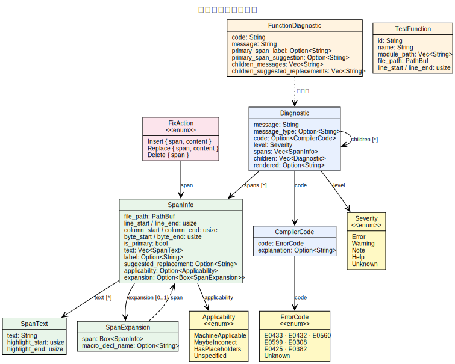

> 图表源文件：[docs/diagrams/07_data_model.dot](docs/diagrams/07_data_model.dot)

### 4.1 编译器诊断（Diagnostic）

```rust
pub struct Diagnostic {
    pub message_type: Option<String>,
    pub code: Option<CompilerCode>,
    pub message: String,
    pub span: Vec<SpanInfo>,
    pub severity: Severity,       // Error | Warning | Note | Help | ...
    pub children: Vec<Diagnostic>, // 嵌套诊断链
    pub rendered: Option<String>,
}

pub struct CompilerCode {
    pub code: ErrorCode,
    pub explanation: Option<String>,
}
```

完整反映 `rustc --message-format=json` 输出结构，支持嵌套 children 以捕获 `help:`/`note:` 附加诊断。

### 4.2 Span 信息

```rust
pub struct SpanInfo {
    pub file_path: PathBuf,
    pub byte_start: usize,
    pub byte_end: usize,
    pub line_start: usize,
    pub line_end: usize,
    pub col_start: usize,
    pub col_end: usize,
    pub is_primary: bool,
    pub text: Vec<SpanText>,
    pub label: Option<String>,
    pub suggested_replacement: Option<String>,
    pub suggestion_applicability: Option<Applicability>,
    pub expansion: Option<Box<SpanExpansion>>,  // 宏展开追踪
}

pub enum Applicability {
    MachineApplicable,
    MaybeIncorrect,
    HasPlaceholders,
    Unspecified,
}
```

### 4.3 修复动作（FixAction）

```rust
pub enum FixAction {
    Insert  { span: SpanInfo, content: String },
    Replace { span: SpanInfo, new_content: String },
    Delete  { span: SpanInfo },
}
```

当前 `CodeTransformer` 仅实现 `Replace` 变体，`Insert` 和 `Delete` 已定义但未使用。

### 4.4 错误码枚举

```rust
pub enum ErrorCode {
    E0433,  // failed to resolve
    E0432,  // unresolved import
    E0599,  // no method found
    E0308,  // mismatched types
    E0560,  // unknown struct field
    E0425,  // cannot find value (已注册，未实现 Patcher)
    E0382,  // value used after move (已注册，未实现 Patcher)
    #[serde(other)]
    Unknown,
}
```

使用 `strum` 的 `EnumString` + `Display` 派生，`Unknown` 作为反序列化回退。

### 4.5 测试函数模型

```rust
pub struct TestFunction {
    pub id: String,              // 稳定标识符
    pub relative_file: PathBuf,
    pub file_path: PathBuf,
    pub module_path: Vec<String>,
    pub fn_name: String,
    pub byte_start: usize,
    pub byte_end: usize,
    pub line_start: usize,
    pub line_end: usize,
}

pub struct FunctionDiagnostic {
    pub code: String,
    pub message: String,
    pub primary_span: Option<String>,
    pub label: Option<String>,
    pub suggested_replacement: Option<String>,
    pub children_note_messages: Vec<String>,
    pub children_help_messages: Vec<String>,
    pub children_suggested_replacements: Vec<String>,
}
```

`FunctionDiagnostic` 是 `Diagnostic` 的函数级简化视图，用于 Dispatch、Preflight 和 LLM 上下文构建。

### 4.6 Patcher Trait

```rust
pub trait Patcher {
    fn error_code(&self) -> ErrorCode;
    fn can_handle(&self, diagnostic: &Diagnostic) -> bool;
    fn analyze(&self, diagnostic: &Diagnostic) -> Result<Vec<FixAction>>;
    fn description(&self) -> &'static str;
}
```

- **Action Patcher**（E0433/E0432/E0560）：`analyze()` 返回具体 `FixAction`
- **Analysis Patcher**（E0599/E0308）：`analyze()` 返回空 `Vec`，分析结果通过 Preflight 注入 LLM 上下文

---

## 5. 编译器输出解析

### 5.1 JsonParser

```rust
impl JsonParser {
    pub fn parse(json_str: &str) -> Result<Vec<Diagnostic>>
}
```

解析 `rustc` 的 **NDJSON**（每行一个完整 JSON 对象）输出。使用 `serde_json` 按行反序列化为 `Diagnostic`。路径通过 `normalize_paths()` 转换为绝对路径。

### 5.2 诊断过滤

在 `analyze_stage()` 中：
- 仅保留 `Severity::Error` 级别的诊断
- 通过 `extract_diagnostic_json_lines()` 从 `cargo check` 的 stdout 中提取 JSON 行（过滤非 JSON 输出）

---

## 6. Function Dispatcher 设计

Function Dispatcher 负责将编译器诊断按测试函数聚合，并决定每个函数的修复路由。

### 6.1 数据模型

```rust
/// 函数内的诊断引用
struct DiagnosticRef {
    diagnostic_index: usize,     // 原始索引（保证排序稳定性与可回放性）
    code: String,
    diagnostic: Diagnostic,
}

/// 函数级补丁任务
struct FunctionPatchTask {
    function_id: String,
    file_path: PathBuf,
    function_line_span: (usize, usize),
    diagnostics_with_index: Vec<DiagnosticRef>,
    error_code_counts: BTreeMap<String, usize>,
    implemented_rule_codes_present: BTreeSet<ErrorCode>,
    unimplemented_codes_present: BTreeSet<String>,
    low_value_status: LowValueStatus,
    low_value_reason: String,
    low_value_markers: Vec<String>,
}

/// 分发决策
enum FunctionDispatchDecision {
    RulePatcher {
        selected_rule_codes: Vec<String>,
        deferred_codes: Vec<String>,
        reason: String,
    },
    LlmPatcher {
        reason: String,
    },
}
```

### 6.2 分发规则

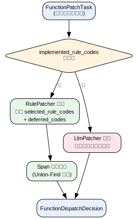

> 图表源文件：[docs/diagrams/02_dispatch_flow.dot](docs/diagrams/02_dispatch_flow.dot)

**分发规则细则**：

1. **RuleFirst**：函数诊断中存在已实现错误码（通过 `PatcherRegistry::implemented_error_codes()` 查询）→ 路由到规则 Patcher。
2. **全未实现**：所有诊断错误码均无对应 Patcher → 直接路由 LLM。
3. **混合错误码**：已实现的走规则路径，未实现的记录为 `deferred_codes`，后由 Partial Union 阶段移交 LLM。
4. **分析型 Patcher 计入**：E0599/E0308 虽返回空动作，但其错误码已注册到 `implemented_error_codes`，保证它们的函数也走 RuleFirst 路由，以便 Preflight 分析生效。

### 6.3 Span 冲突仲裁

当单个函数内多个规则诊断的 primary span 存在字节范围重叠时，使用 **Union-Find** 算法聚合冲突组：

1. 遍历所有候选诊断对，检测 span 是否重叠（同文件 + 字节范围交集非空）
2. 重叠的诊断合并到同一组
3. 每组内按优先级选择胜者：
   - primary span > non-primary span
   - 原始诊断索引较小优先
4. 非胜者记录为 `SuppressedDiagnostic`，保留证据

### 6.4 FunctionIndex

`FunctionIndex` 通过 `syn` AST 分析构建测试函数索引：

- 扫描 `#[cfg(test)]` 模块内的 `#[test]` 函数
- 扫描 `tests/` 目录下的集成测试文件
- 使用**行号映射**（而非字节偏移）定位诊断到函数，提高稳定性
- 每个函数生成唯一 `id`（基于文件路径 + 模块路径 + 函数名）

### 6.5 LowValue 检测

LowValue 检测在函数聚合阶段（`build_function_patch_tasks`）执行，分析函数体是否包含测试语义信号。

**测试语义信号**（任意命中即 `HasTestSemantics`）：

| 信号类别 | 检测目标 |
|---|---|
| 断言宏 | `assert!`、`assert_eq!`、`assert_ne!`、`debug_assert!`、`debug_assert_eq!`、`debug_assert_ne!`、`assert_matches!` |
| 显式失败 | `panic!`、`unreachable!`、`todo!`、`unimplemented!` |
| 解包 | `.unwrap()`、`.expect(...)` |
| 错误传播 | `?` 操作符 |

实现方式：`syn` AST 轻量遍历（`TestSemanticMarkerCollector`，仅函数体级扫描）。

**分类结果**：

```rust
pub enum LowValueStatus {
    HasTestSemantics,  // 有测试语义信号
    LowValue,          // 无任何测试语义信号
    Unknown,           // AST 解析失败，保守降级
}
```

`Unknown` 不直接触发注释动作；`LowValue` 仅作为信号输入后续 Preflight 决策，不单独触发全局注释。

---

## 7. Pre-flight Interceptors

Pre-flight Interceptors 在进入 LLM 修复循环之前执行，通过多维度静态分析生成路由决策与上下文注入。

### 7.1 决策模型

```rust
enum PreflightDecision {
    ContinueToLlm { reason: String },
    ContinueToLlmWithHints { reason: String, hints: Vec<String> },
    SkipLlmCommentOut { reason: String, risk_flags: Vec<String> },
}
```

### 7.2 五维分析编排

Preflight 分析器在 `llm::preflight::mod.rs` 中编排，依次分析五个维度：

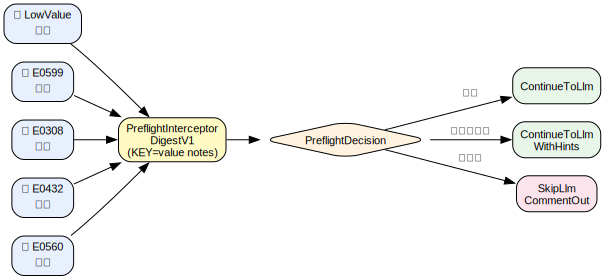

> 图表源文件：[docs/diagrams/03_preflight_pipeline.dot](docs/diagrams/03_preflight_pipeline.dot)

每个分析器将结构化结果写入 `PreflightInterceptorDigestV1.notes`（`KEY=value` 格式，单条最长 240 字符），供 Prompt 直接引用。

若不需要分析，或分析结果为空，则不会注入 Prompt 中，避免污染上下文。

### 7.3 决策优先级

决策逻辑按以下优先级从高到低应用（命中即停止）：

| 优先级 | 场景 | 决策 | 依据 |
|---|---|---|---|
| 高 | E0599 `MisplacedFreeFunction` | `ContinueToLlmWithHints` | 命名空间错位（自由函数被误写为关联函数） |
| 次 | E0308 `SetupHell` | `SkipLlmCommentOut` | 框架内部类型不可构造 |
| 次 | E0308 `NominalHallucination` + `LowValue` | `SkipLlmCommentOut` | 类型幻觉 + 无测试语义 |
| 次 | E0599 `SevereNoStruct`/`SevereEmptyImpl` + `LowValue` | `SkipLlmCommentOut` | 严重幻觉 + 无测试语义 |
| 次 | E0308 `MechanicalMismatch`/`WrapperMismatch`/`NominalHallucination` | `ContinueToLlmWithHints` | LLM 可修复，注入类型提示 |
| 最低 | 其他所有场景 | `ContinueToLlm` | 保守放行 |

所有 `SkipLlmCommentOut` 动作必须通过 verify 门禁才能接纳；验证失败则自动回退为 `ContinueToLlm`。

### 7.4 预算兜底（Budget Fallback）

当函数经过所有 LLM 轮次后仍未收敛且预算耗尽时：
- 仅对 E0308 高风险场景（`SetupHell` 或 `NominalHallucination` + `LowValue`）执行一次保守性注释尝试（`preflight_budget_e0308`）
- 其余场景保留 unresolved handoff，避免降级策略扩大化

### 7.5 Preflight Digest 注入键规范

| 来源 | 注入键 | 语义 |
|---|---|---|
| Env | `CRATE_ENV_NO_STD` | 当前 crate 是否检测到 `#![no_std]`（`true/false`） |
| LowValue | `LOW_VALUE_STATUS` | `LOW_VALUE` / `HAS_TEST_SEMANTICS` / `UNKNOWN` |
| LowValue | `LOW_VALUE_MARKERS` | 触发标记列表（触发时） |
| E0599 | `E0599_CLASSIFICATION` | 五级分类名 + 扫描范围 |
| E0599 | `E0599_SUMMARY` | 一句话分析摘要 |
| E0599 | `E0599_METHOD_SIGNATURES` | 同类型可用方法签名（最多 6 条，管道分隔） |
| E0599 | `E0599_RELATED_FREE_FN_SIGNATURES` | 相关自由函数签名（最多 6 条，管道分隔） |
| E0599 | `E0599_NAMESPACE_HINT` | 命名空间纠偏提示（移除 `Type::`，建议 `fn(...)` 或 `crate::fn(...)`） |
| E0599 | `E0599_NO_STD_PRIMITIVE_TOSTRING` | 原始类型 to_string 幻觉标记 true type=usize 格式（触发时） |
| E0308 | `E0308_CLASSIFICATION` | 五级分类名 |
| E0308 | `E0308_EXPECTED` | 编译器提取的期望类型 |
| E0308 | `E0308_FOUND` | 编译器提取的实际类型 |
| E0308 | `E0308_EXPECTED_ARRAY_LEN` | 期望类型中可解析的数组长度（可解析时） |
| E0308 | `E0308_FOUND_ARRAY_LEN` | 实际类型中可解析的数组长度（可解析时） |
| E0308 | `E0308_LEN_DELTA` | `found_len - expected_len`（可解析时） |
| E0308 | `E0308_HINTS` | 类型对分析提示（最多 4 条，管道分隔） |
| E0432 | `E0432_COUNT` | 该函数 E0432 错误总数 |
| E0432 | `E0432_SUMMARY` | 摘要描述 |
| E0432 | `E0432_HINTS` | 去重后的替换候选路径（最多 4 条） |
| E0560 | `E0560_COUNT` | 该函数 E0560 错误总数 |
| E0560 | `E0560_UNKNOWN_FIELDS` | 去重后的未知字段名列表（最多 6 条） |
| E0560 | `E0560_AVAILABLE_FIELDS` | 候选字段名（最多 8 条） |
| E0560 | `E0560_HINTS` | 编译器 replacement 或字段重写提示（最多 4 条） |

---

## 8. Rule Patchers 设计

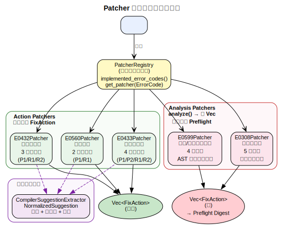

> 图表源文件：[docs/diagrams/08_patcher_hierarchy.dot](docs/diagrams/08_patcher_hierarchy.dot)

### 8.0 编译器建议提取公共层

所有 Rule Patcher 共享的编译器建议提取基础设施位于 `patchers::common::compiler_suggestion`。

```rust
pub struct NormalizedSuggestion {
    pub raw: String,
    pub normalized_text: Option<String>,   // 去除 `use` 前缀/分号/空白
    pub source: SuggestionSource,          // Span | ChildMessage | MainMessage
    pub applicability: Option<Applicability>,
    pub executable: bool,
    pub blocked_reason: Option<String>,    // 如 "command hint" (cargo add)
}
```

**分层职责**：
- **公共层**：提取、标准化、可执行性判定（`is_cargo_command()` 过滤）、阻塞原因保留、去重
- **错误码层**：语义分类、候选评分、策略决策

**提取优先级**：
1. `span.suggested_replacement`（直接来自 primary/secondary span）
2. `child help/note` 消息文本中的路径提取（正则匹配 `` use `...` ``）
3. `main message` 关键词提取（回退）

**归一化规则**：
- 去除 `use ` 前缀和 `;\n` 后缀
- 验证路径结构（`is_rust_path_candidate`：标识符段由 `::` 分隔）
- `cargo add xxx` 类命令行提示标记为 `executable: false`

---

### 8.1 E0433Patcher

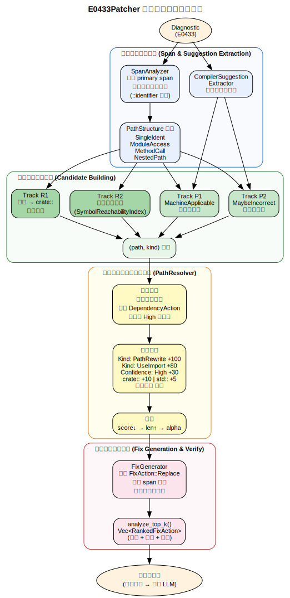
> 图表源文件：[docs/diagrams/09_e0433_layers.dot](docs/diagrams/09_e0433_layers.dot)

#### 一、E0433 错误原理

Rust 的模块系统是严格的名称空间系统，所有符号在编译时须通过完整的限定路径或 `use` 声明显式可见。E0433 在编译器中对应 "failed to resolve" 系列，触发的根本原因是：**路径的第一个段（head）在当前模块的名称解析上下文中找不到对应的绑定**。

编译器消息有多种句型，`extract_unresolved_head` 需同时覆盖：

| 句型 | 示例 |
|---|---|
| `use of undeclared crate or module \`X\`` | 最常见形式 |
| `could not find \`X\` in the crate root` | 测试模块 `use` 中间段幻觉 |
| `could not find \`X\` in \`Y\`` | 嵌套模块路径查找失败 |
| `you might be missing extern crate \`X\`` | 标准库/依赖模块被误前缀包装 |

LLM 生成测试函数时此类错误极为常见，典型场景有四种：

- **场景 A：包名错用为路径前缀**。crate 名为 `humantime`，LLM 在测试中写出 `humantime::parse_duration(...)`，但 `humantime` 在当前文件里并非已声明的模块——在 `src/` 的 `#[cfg(test)]` 块中，需要 `crate::` 或 `use` 声明。
- **场景 B：包名与 `crate` 关键字混淆**。LLM 写出 `my_crate::Foo`，其中 `my_crate` 恰好是当前 crate 的包名。在 Rust 2018+ edition 中，应写 `crate::Foo`。
- **场景 C：符号漂移，路径段拼写错误或上下文缺少 `use` 声明**。编译器通常会给出 `help: consider importing this ...` 形式的机器可应用建议。
- **场景 D：中间路径段包含幻觉模块**。LLM 写出 `crate::run_id::wrapper::Duration`，其中 `run_id` 是不存在的子模块，编译器报告 `could not find \`run_id\` in the crate root`。正确路径应为 `crate::wrapper::Duration`。
- **场景 E：模块上下文混淆**。文件在 `mod v0` 内，LLM 写出 `v0::Parser`，混淆了 `v0` 是外部模块前缀。编译器报错 `could not find \`v0\` in the crate root`。正确路径应为 `crate::v0::Parser`（保留原始路径的完整模块段，仅补 `crate::` 前缀）。
- **场景 F：标准库误前缀包装**。LLM 写出 `use crate::core::clone::Clone;`，错误地将标准库模块 `core` 包装在 `crate::` 前缀下。编译器报告 `could not find \`core\` in the crate root`（或 `you might be missing extern crate \`core\`）。正确路径应为 `use core::clone::Clone;`（去掉 `crate::` 前缀，因为 `core` 是隐式 extern crate，不在当前 crate 内）。此现象也适用于 `std`、`alloc`、`proc_macro`、`test` 等隐式 extern crate，或任何 Cargo.toml 显式依赖的外部 crate。

#### 二、为何可以用规则修复

E0433 的修复目标单一：**找到正确的完整路径替换掉错误的路径段**。修复代价低（字节级替换），且 rustc 编译器本身在诊断中往往携带了高质量的 `MachineApplicable` 建议。核心约束：**修复只在测试代码中进行**。正确性保障来自编译级 verify 验证。

#### 三、E0433 内部模块结构

```text
e0433/
├── types.rs              # CandidateFix, PathStructure, ExtendedSpan, PathSegment
├── context.rs            # TestContextDetector（测试上下文检测）
├── span_analyzer.rs      # SpanAnalyzer（span 扩展 + 路径结构分析）
├── reachability_index.rs # SymbolReachabilityIndex（crate 内符号可达性）
├── path_resolver.rs      # PathResolver（候选排序 + 约束过滤）
├── fix_generator.rs      # FixGenerator（FixAction 生成）
└── patcher.rs            # E0433Patcher + RankedFixAction
```

#### 四、候选来源分类

| 候选轨道 | 来源 | 触发条件 |
|---|---|---|
| **Compiler Track P1** | rustc `MachineApplicable` span suggestion | 编译器给出可应用替换 |
| **Compiler Track P2** | rustc `MaybeIncorrect` 或 child help 文本 | 编译器给出参考性建议 |
| **Heuristic R1** | 包名 → `crate::` 重写 | head 精确等于 `package.name` |
| **Heuristic R2** | crate 内符号唯一性推断 | head 非依赖，tail 唯一可达 |
| **Heuristic R3** | 误前缀外部 crate 去除 | head 为隐式/显式 extern crate（需去 `crate::` 前缀） |

#### 五、四层架构

**第一层：证据提取层（Span & Suggestion Extraction）**

- 从 `Diagnostic` 的 primary span 定位字节范围
- `SpanAnalyzer::analyze()` 向前扫描 `::identifier` 模式，扩展 span 以捕获完整路径（如 `State::new` 而非仅 `State`）
- 解析路径结构：`SingleIdent` / `ModuleAccess` / `MethodCall` / `NestedPath`
- 通过 `CompilerSuggestionExtractor` 提取归一化建议

**第二层：候选构建层（Candidate Building）**

- **P1/P2**：直接从编译器建议构建 `CandidateFix`，按 `Applicability` 标注置信度
- **R1**（包名或模块重写）：若 head == `package.name`（包名精确匹配）且路径以该包名开头：
  1. **模块保留策略**：检测 head 本身是否为 crate root 可见模块（扫描 `src/` 目录查证 `src/<head>/mod.rs` 或 `src/<head>.rs` 文件），若是则保留 head，生成 `crate::head::suffix`（场景 E：`v0::Parser` → `crate::v0::Parser`）。
  2. **模块清除策略**：若 head 非模块，采用原有"丢 head 保 tail"逻辑，生成 `crate::suffix`（场景 A-B：`humantime::parse_duration` → `crate::parse_duration`）。
  - 依赖门禁保持：head 命中 `Cargo.toml` 中任意依赖名（含 `rename` 别名）时跳过 R1，防止误改外部 crate。
- **R2**（模块可达性 + 唯一符号推断）：通过 `SymbolReachabilityIndex`（全局 `OnceLock<Mutex<HashMap>>` 缓存）扫描 `src/` 目录，分两阶段判断：
  1. **模块可见性门禁**：检测 `tail`（路径首段）是否为 crate 内可见模块——覆盖 `pub mod` 与非 `pub` 的同 crate 内 `mod` 声明（`mod.rs` / `<name>.rs` 文件存在即视为可见）。命中则生成 `crate::tail` 候选，置信度 `High`
  2. **唯一符号兜底**：`tail` 非模块时，退回正则匹配 `pub fn/struct/enum/trait/type/const/static NAME` 和 `pub use ... as NAME`，计数 `== 1` 时生成 `crate::tail` 候选，置信度 `Medium`
  - 依赖门禁跳过R2：`tail` 命中 `Cargo.toml` 中任意依赖名（含 `rename` 别名）时跳过 R2，防止误将外部 crate 改写为 `crate::`
- **R3**（误前缀外部 crate 去除）：当诊断文案命中 `missing crate` 句型或 head 为隐式/显式 extern crate 时：
  1. **隐式 extern crate 检测**：head 为 `core`、`std`、`alloc`、`proc_macro`、`test` 之一 → 生成去 `crate::` 前缀候选（场景 F：`crate::core::clone::Clone` → `core::clone::Clone`），置信度 `High`
  2. **显式依赖检测**：head 命中 `Cargo.toml` 中任意依赖名（含 `rename` 别名）且路径形态为 `crate::head::...` → 生成去 `crate::` 前缀候选（场景 F：`crate::serde::Serialize` → `serde::Serialize`），置信度 `High`
  - **冲突避免**：若 head == `package.name`，跳过 R3，由 R1 的模块保留策略处理
  - **错误检验**：编译器文案不含 `missing` 或 `extern` 关键词，且 head 既非隐式 extern 也非依赖时，不生成 R3 候选
- 候选按 `(suggested_path, kind)` 去重

**第三层：约束过滤与评分层（PathResolver）**

评分策略（分值越高越优先）：

| 维度 | 权重 |
|---|---|
| Kind: `PathRewrite` | +100 |
| Kind: `UseImport` | +80 |
| Kind: `DependencyAction` | +30 |
| Confidence: `High` | +30 |
| Confidence: `Medium` | +20 |
| Confidence: `Low` | +10 |
| 路径前缀 `crate::` | +10 |
| 路径前缀 `std::` | +5 |
| 路径长度 | 负分（短路径优先） |

约束过滤：
- 剔除非可执行候选
- 测试上下文中禁用 `DependencyAction`
- 仅返回 `High` 置信度结果

排序序列：score（降序）→ 路径长度（升序）→ 字母序

**第四层：动作输出层（Fix Generation & Verify）**

`FixGenerator::generate()` 将解析结果映射为 `FixAction::Replace`：
- 保留 span 之后的后缀以避免扩大编辑面
- 例：resolved `crate::foo::State`，extended segments `["State", "new"]` → 输出 `crate::foo::State::new`
- 若生成结果与原文相同则返回 `None`

`E0433Patcher::analyze_top_k()` 返回 `Vec<RankedFixAction>`，包含每个候选的分数、路径、置信度和来源ID。

降级策略：空候选集是合法输出，不触发异常，由后续 Partial Union + LLM 处理。

#### 六、函数外诊断归属（Function-Scope Fallback）

E0433 错误有时落在测试模块的 `use` 语句上（函数体外），而非测试函数体内部。原先此类诊断因无法被 `FunctionIndex` 行号映射到任何函数，直接归入 `__UNMAPPED_ERRORS__` 后规则路径终止。

**测试模块范围回落映射**（`runtime::function::index` 层）：

1. 若诊断行号落在某个 `#[cfg(test)]` 模块范围内但不在任何具体测试函数体内，则将该诊断归属到**同一测试模块内的首个 `#[test]` 函数**（作为代理任务宿主）。
2. 代理任务仍沿用 E0433 的 `is_test_context` 保护，不扩大到生产代码路径。
3. 若同一模块内无任何 `#[test]` 函数，则保持原有 `__UNMAPPED_ERRORS__` 行为，不强制归属。

该机制使得 `use crate::some_module::SomeType;` 形式的函数外导入错误可进入 RuleFirst 路径，由 E0433Patcher 正规处理并通过 verify 门禁验证。

---

### 8.2 E0432Patcher

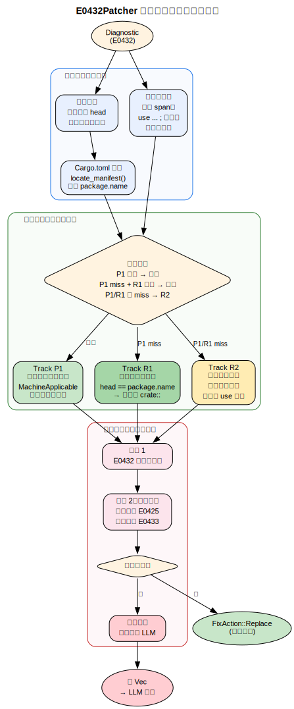
> 图表源文件：[docs/diagrams/13_e0432_layers.dot](docs/diagrams/13_e0432_layers.dot)

#### 一、E0432 错误原理

E0432 代表**"未解析的导入"**。当 `use` 语句引用的路径在模块树或外部依赖中找不到时触发。与 E0433 同源（名称解析失败），但严格限定在 `use` 声明层面。

**关键风险**：错误地抹除一个被实际引用的 `use` 语句会引发级联错误（E0425/E0433 爆发）。

#### 二、LLM 语境下的错误模式

| 模式 | 典型信号 | 策略 |
|---|---|---|
| **根路径幻觉** | head == 当前包名 | R1 重写 → `crate::` |
| **相对路径计算错误** | `super::super::Foo` | P1 编译器建议直通 |
| **冗余导入** | 零引用的幻觉依赖 | R2 注释化（需级联验证） |
| **核心幻觉依赖** | 深度引用的不存在模块 | 降级移交 LLM |

#### 三、三轨修复策略

| 候选轨道 | 策略名称 | 触发条件 | 置信度 |
|---|---|---|---|
| **Track P1** | 编译器建议直通车 | `MachineApplicable` suggestion 存在 | `High` |
| **Track R1** | 根路径精确重写 | head 精确等于 `package.name` | `High` |
| **Track R2** | 静默裁切探测 | P1、R1 未命中，测试语境内的 `use` 语句 | `Medium` |

**P1 实现细节**：
- 收集所有 `MachineApplicable` 建议
- 按 (file_path, byte_start, byte_end) 排序
- 贪心保留非重叠 span（首条优先）

**R1 实现细节**：
- 正则提取 unresolved import `` `([^`]+)` `` 中的 head
- 加载 `Cargo.toml` 的 `package.name`（通过 `locate_manifest()` 向上查找）
- 匹配则替换 head 为 `crate`

**R2 实现细节**：

- 仅限单行 span、测试语境（检测 `#[cfg(test)]`/`#[test]`/`#[tokio::test]`/`#[rstest]`）
- 验证确实是以 `use` 开头且以 `;` 结尾的行
- 注释化为 `// ruter(e0432-r2): disabled unresolved import: <原始行>`

#### 四、级联阻断验证

E0432 修复的验证条件必须**同时满足**：
1. 目标函数 E0432 错误数严格下降
2. **零级联衍生**：不得新增 E0425（找不到值/函数）或 E0433（路径解析失败）

违反条件 2 则回滚。

---

### 8.3 E0560Patcher

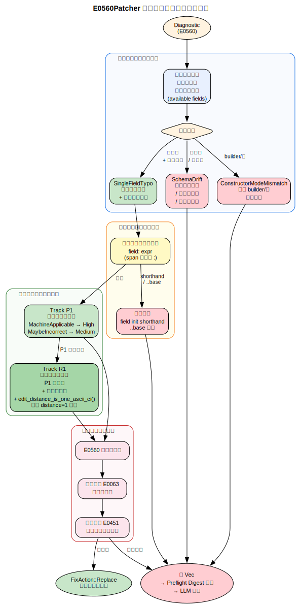
> 图表源文件：[docs/diagrams/14_e0560_layers.dot](docs/diagrams/14_e0560_layers.dot)

#### 一、E0560 错误原理

E0560 代表**"在 struct 上指定了不存在的字段"**。struct expression 的字段名校验阶段触发。

#### 二、设计定位

E0560Patcher 是**窄口径 Action Patcher**：只修**高置信度单字段名错误**；对 schema drift、builder-only、内部构造类型返回空动作。

#### 三、错误模式分类

| 分类 | 典型信号 | 策略 |
|---|---|---|
| `SingleFieldTypo` | 单个未知字段 + `available fields` 中有唯一近邻 | 规则修复 |
| `SchemaDrift` | 多个未知字段 / 候选不唯一 / 相似度不足 | 返回空动作 |
| `ConstructorModeMismatch` | 更适合 builder / 宏 | 返回空动作 |

#### 四、双轨修复策略

| 候选轨道 | 策略名称 | 触发条件 | 置信度 |
|---|---|---|---|
| **Track P1** | 编译器建议直通 | `MachineApplicable` 或 `MaybeIncorrect` applicability | `High`/`Medium` |
| **Track R1** | 唯一字段名重写 | P1 无候选 + 仅 1 个未知字段 + `available fields` 中有唯一 edit-distance=1 匹配 | `Medium` |

**关键过滤规则**：
- 仅处理**显式命名字段**语法（`field: expr`），通过检查 span 后是否紧跟 `:`、前是否为 `{` 或 `,`
- 不处理 field init shorthand、`..base` 相关推理
- `edit_distance_is_one_ascii_ci()`：ASCII 大小写不敏感、$O(n)$ 单编辑距离算法

**验证条件**：
1. 目标函数 E0560 错误数下降
2. 不得新增 E0063（缺字段）或 E0451（私有字段构造）
3. 不得对非目标引入回归

#### 五、Preflight Digest 注入

E0560 不产生 `SkipLlmCommentOut` 决策，仅生成 digest-only 的 Preflight 注入（`E0560_COUNT`、`E0560_UNKNOWN_FIELDS`、`E0560_AVAILABLE_FIELDS`、`E0560_HINTS`），增强 LLM 上下文。

#### 六、ExprStruct 符号采集

L2 上下文提取（`SymbolCollector`）显式采集 `ExprStruct.path`，执行"**末段类型名优先 + 首段回退**"策略（如 `foo::Parser { ... }` 优先注入 `Parser`，同时保留 `foo` 作为回退），保证 E0560 场景的上下文注入稳定性。

---

### 8.4 E0599Patcher

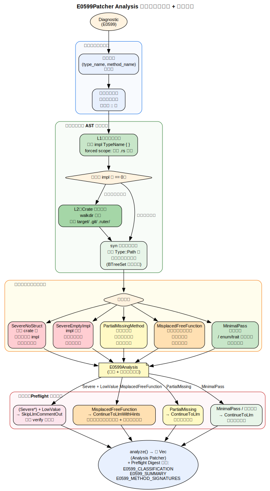
> 图表源文件：[docs/diagrams/15_e0599_layers.dot](docs/diagrams/15_e0599_layers.dot)

#### 一、E0599 错误原理

E0599 代表"在类型上找不到目标方法或关联项"。路径已解析到类型，但目标方法在 impl 块中不存在。

#### 二、设计定位

E0599Patcher 是 **Analysis Patcher**：`analyze()` 始终返回空 `Vec`，不直接生成修复动作。核心价值在于 crate 级 AST 扫描与五级分类，为 Preflight 和 LLM 提供精确上下文，也可针对性识别“命名空间错位”问题（自由函数被误写成关联函数）。

#### 三、分类体系

| 分类 | 条件 | 风险 |
|---|---|---|
| `SevereNoStruct` | crate 内找不到该类型的任何 impl | 最高 |
| `SevereEmptyImpl` | impl 存在但无任何方法 | 高 |
| `PartialMissingMethod` | 有其他方法但目标方法不存在 | 中 |
| `MisplacedFreeFunction` | impl 中缺失目标方法，但同文件/同 crate 找到同名（或编辑距离 1 且唯一）的自由函数 | 中 |
| `MinimalPass` | 方法存在或无法确认（enum/trait 保守降级） | 低 |

#### 四、分析流程

```rust
pub fn analyze_e0599_against_crate(
    crate_path: &Path,
    same_file: &Path,
    message: &str,
) -> E0599Analysis
```

1. 从诊断消息正则提取 `(type_name, method_name)` 二元组
2. 类型名归一化：去除泛型参数，取最后 `::` 段
3. **两级扫描策略**：
   - 先在同文件中扫描 `impl TypeName { ... }` 块
   - 若同文件 impl 数量为零，回退到 crate 范围（`walkdir` 递归，跳过 `target/`、`.git/`、`.ruter/`）
4. 使用 `syn` 解析 Rust 文件，匹配 `Type::Path` 段
5. 收集可用方法签名（`func.sig.to_token_stream()`），去重排序为 `BTreeSet`
6. **自由函数补扫（仅在 `PartialMissingMethod` 路径触发）**：
   - 先扫描 `same_file` 的 `Item::Fn`
   - 未命中时回退到 crate 范围扫描
   - 匹配策略：优先精确同名；若无精确命中，仅允许“编辑距离=1 且唯一候选”的保守兜底（多候选 fail-closed）
7. 分析结果额外输出：
   - `related_free_function_signatures`：自由函数签名证据
   - `recommended_call_forms`：推荐调用形式（如 `format_rfc3339(...)`、`crate::format_rfc3339(...)`）

#### 五、Preflight 决策映射

| 场景 | 决策 |
|---|---|
| `(SevereNoStruct \| SevereEmptyImpl)` + `LowValue` | `SkipLlmCommentOut`（需 verify 通过） |
| `MisplacedFreeFunction` | `ContinueToLlmWithHints`（注入命名空间纠偏 hint + 推荐调用形式） |
| `PartialMissingMethod` | `ContinueToLlm`（保守放行，不做激进推断） |
| `MinimalPass` 或分析失败 | `ContinueToLlm`（保守降级） |

---

### 8.5 E0308Patcher

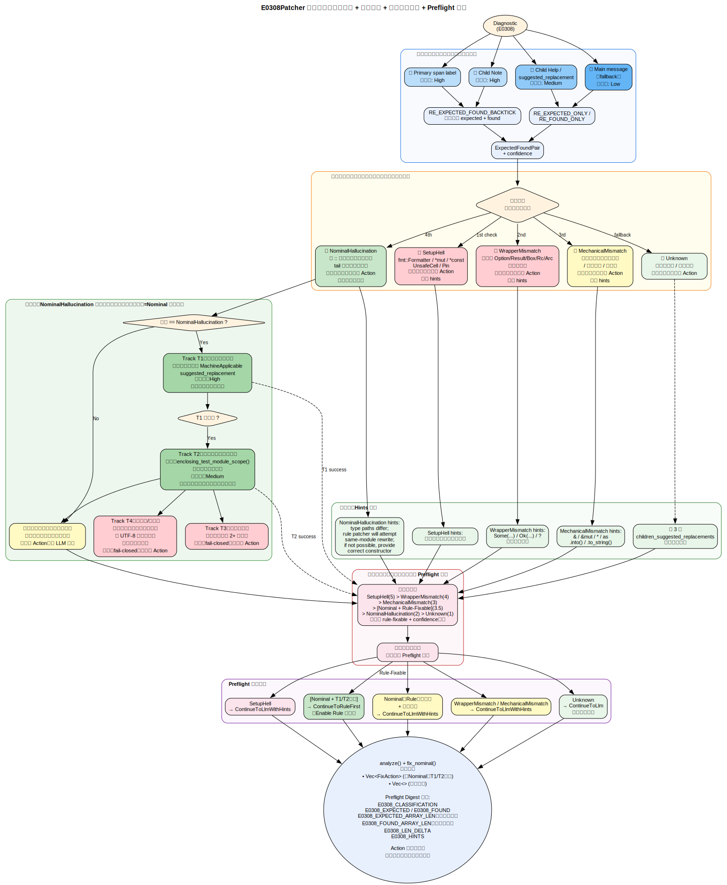
> 图表源文件：[docs/diagrams/16_e0308_layers_hybrid.dot](docs/diagrams/16_e0308_layers_hybrid.dot)

#### 一、E0308 错误原理

E0308 代表"类型不匹配"——实际类型（Found）与期望类型（Expected）不一致，且不存在隐式强制转换关系。Rust 名义类型系统的严格性使得 E0308 覆盖面极广。

另外，在 `E0433 -> E0308` 修复漂移场景中，系统尝试修复未解析路径（E0433）时，常引入新的代码导致类型不匹配（E0308）。典型例：期望 `wrapper::Duration` 但实际得到 `std::time::Duration`。两个类型在尾标识符上相同（均为 `Duration`），但路径前缀完全不同，属于**名义类型系统**的严格区分。

#### 二、设计定位

E0308Patcher 采用**混合策略**：
- **Analysis 层**（始终执行）：提取高质量的类型差异证据，分类判断修复成本与风险
- **Rule Transform 层**（条件执行）：当分类为 `NominalHallucination` 且满足后述触发条件时，在**同测试模块范围内**执行确定性的类型路径替换，直接生成 `FixAction`

#### 三、多源提取策略

按优先级从 `Diagnostic` 中提取 `expected_type` 与 `found_type`：

```
primary span label → ChildNote → ChildHelp/suggested_replacement → main message（fallback）
```

使用三个编译正则：
- `RE_EXPECTED_FOUND_BACKTICK`：同时匹配 expected 和 found
- `RE_EXPECTED_ONLY_BACKTICK`：仅匹配 expected
- `RE_FOUND_ONLY_BACKTICK`：仅匹配 found

**置信度分级**：

| 来源 | 置信度 |
|---|---|
| Primary Label | `High` |
| Child Note | `High` |
| Child Help | `Medium` |
| Main Message | `Low` |

#### 四、五级分类体系

分类按优先级判定（命中即停止）：

| 优先级 | 分类 | 判断信号 | 修复策略 |
|---|---|---|---|
| 最高 | `SetupHell` | expected/found 含 `fmt::Formatter`、`*mut`、`*const`、`UnsafeCell<`、`Pin<` | 不生成 Action，注入 hints |
| 次 | `WrapperMismatch` | 一侧有 `Option<`/`Result<`/`Box<`/`Rc<`/`Arc<`，另一侧没有 | 不生成 Action，注入 hints |
| 次 | `MechanicalMismatch` | 去引用后基础类型相同，或同为字符串族/数值族 | 不生成 Action，注入 hints |
| 次 | `NominalHallucination` | 含 `::` 路径或首字母大写名义类型，tail 相同但路径不同 | **条件生成 Action**（见下文四轨策略） |
| 最低 | `Unknown` | 以上不命中或提取失败 | 不生成 Action |

分析产物包含分类、`ExpectedFoundPair`、置信度和生成的 hints 列表。

#### 五、四轨修复策略（Nominal Hallucination 专用）

仅当分类确定为 `NominalHallucination` **且** 以下条件全部满足时，E0308Patcher 生成 `FixAction::Replace`：

| 候选轨道 | 策略名称 | 触发条件 | 置信度 |
|---|---|---|---|
| **Track T1** | 编译器建议直通 | 诊断携带 `MachineApplicable` suggested_replacement | `High` |
| **Track T2** | 同模块变量绑定推断 | 诊断不含建议，但在**同测试模块范围**内找到唯一与错误相关的变量绑定 | `Medium` |
| **Track T3** | 多候选降级 | 存在 2+ 个同模块候选绑定 | （不生成，fail-closed） |
| **Track T4** | 跨模块/不安全 | found_type 路径跨越模块边界或替换结果包含坏路径 | （不生成，fail-closed） |

**T1 实现**：
- 若 `suggested_replacement` 存在且逻辑上是替换 `found_type` 为 `expected_type` 的路径重写，直接应用

**T2 实现细节**（核心规则修复逻辑）：
1. 调用 `FunctionIndex::enclosing_test_module_scope(diagnostic.function_id)` 获取诊断所属的测试模块范围（file + line/byte range）
2. 在模块范围内向后扫描，定位包含 `found_type` 尾标识符的最近变量定义或赋值语句（如 `let duration = std::time::Duration::from_secs(1);`）
3. 验证该绑定语句确实引入了 `found_type` 的实例（通过类型注解或初始值推导）
4. 生成 Replace 动作：将绑定语句中的 `found_type` 路径替换为 `expected_type` 路径
   - 例：`let duration: std::time::Duration = ...` → `let duration: wrapper::Duration = ...`
   - 仅替换类型路径部分，不改变变量名、初始化值、或其他上下文

**失败关闭条件**（T3 & T4）：
- 同模块内存在 2+ 个匹配的绑定语句 → 歧义，不生成 Action
- 替换后的路径包含明显坏路径特征（如 `crate::std::...`、递归路径） → 不生成 Action
- found/expected 中任一为泛型或包含生命周期复杂性 → 不生成 Action
- UTF-8 边界不安全（替换跨越多字节字符或注释边界） → 不生成 Action
- `expected_type` 路径段数 > `found_type` 超过 2 倍 → 不生成 Action（修复成本过高）

**模块范围回退**：
- 若 `enclosing_test_module_scope()` 返回 `None`（诊断不在任何测试模块内），退回函数级别搜索
- 若函数级搜索也无唯一候选，则不生成 Action，由 LLM 后续处理

#### 六、Hints 生成

| 分类 | Hints 内容 |
|---|---|
| `SetupHell` | "avoid constructing internal runtime-only types" |
| `WrapperMismatch` | 建议 `Some(...)`、`Ok(...)`、`?` 等包装操作 |
| `MechanicalMismatch` | 建议 `&`、`&mut`、`*`、`as`、`.into()`、`.to_string()` |
| `NominalHallucination` | "type paths differ; rule patcher will attempt same-module rewrite; if not possible, provide correct constructor in context" |
| 补充来源 | 取前 3 条 `children_suggested_replacements` |

#### 七、Preflight 中的 E0308 决策

当函数内存在多个 E0308 诊断时，选择**最高优先级**的一条用于 Preflight 决策：

规则修复可行性评分（分值越高优先级越高）：

```
SetupHell (5) > WrapperMismatch (4) > MechanicalMismatch (3) > [NominalHallucination + Rule-Fixable] (3.5) > NominalHallucination (2) > Unknown (1)
```

其中"NominalHallucination + Rule-Fixable"表示既满足 NominalHallucination 分类，同时 T1/T2 条件已验证可行的情形。

**Preflight 决策映射**：

| 场景 | 决策 |
|---|---|
| `[NominalHallucination + T1/T2] + TryRuleFirst` | `ContinueToRuleFirst`（Enable Rule 修复，不降级 LLM） |
| `NominalHallucination`（Rule 不可行）+ 其他分类 | `ContinueToLlmWithHints` |
| `SetupHell` 或 `WrapperMismatch` | `ContinueToLlmWithHints` |
| `Unknown` | `ContinueToLlm`（保守降级，不注入分类信息） |

在同级内按 rule-fixable + confidence + hint 数量排序。

---

## 9. LLM Patcher 设计

Rule Patcher 阶段完成后，仍有未解析函数通过 Partial Union 汇总进入 LLM 阶段。Preflight 决策已确定各函数路由：`SkipLlmCommentOut` 在此阶段执行注释并验证；`ContinueToLlm` / `ContinueToLlmWithHints` 进入完整闭环。

### 9.1 上下文构建（Context Schema v1）

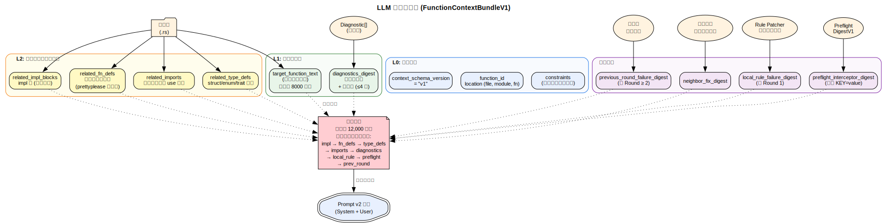

> 图表源文件：[docs/diagrams/10_llm_context.dot](docs/diagrams/10_llm_context.dot)

上下文以 `FunctionContextBundleV1` 为统一契约，分三个信息层级：

| 层级 | 包含字段 | 说明 |
|---|---|---|
| L0 | `context_schema_version`、`function_id`、`location`、`constraints` | 函数定位元数据与修复约束 |
| L1 | `target_function_text`、`diagnostics_digest` | 目标函数源码 + 错误码计数 + 主诊断条目（最多 4 条） |
| L2 | `related_imports`、`related_type_defs`、`related_impl_blocks`、`related_fn_defs` | 同文件语义上下文，按符号相关性过滤 |

**L2 筛选策略**：

- `related_imports`：对文件所有 `use` 语句按目标函数体内引用的标识符名过滤
- `related_type_defs` / `related_impl_blocks`：struct/enum/trait/impl 块，名称须命中函数体引用的符号集
- `related_fn_defs`：**诊断消息反引号标识符驱动**——从编译器 message/label 的反引号词中提取符号名，命中同文件自由函数定义时整体注入（`prettyplease` 格式化）
- `SymbolCollector`（基于 `syn::visit::Visit`）采集 `ExprPath.head`、`TypePath.head`、`ExprStruct.path`（末段优先 + 首段回退）

**扩展附件字段**：

| 字段 | 触发条件 | 内容 |
|---|---|---|
| `neighbor_fix_digest` | 始终尝试 | 已成功修复的邻域函数摘要 |
| `local_rule_failure_digest` | Round = 1 | 本地规则阶段验证失败摘要 |
| `preflight_interceptor_digest` | 始终 | Preflight 五维分析的结构化 notes |
| `previous_round_failure_digest` | Round ≥ 2 | 同函数上一轮失败摘要（修复文本 + 失败分类 + 错误码计数） |
| `rule_error_drift_digest` | 检测到错误码漂移时 | 规则阶段错误码漂移证据（原始码、当前码、漂移对、失败规则方案、原始函数源码） |
| `truncated_sections` | 超预算时 | 被裁剪字段名列表 |

**`RuleErrorDriftDigestV1` 数据结构**：

```rust
pub struct RuleErrorDriftDigestV1 {
    pub original_error_by_code: BTreeMap<String, usize>, // 规则前基线
    pub current_error_by_code: BTreeMap<String, usize>,  // 当前剩余
    pub drift_pairs: Vec<RuleErrorDriftPairV1>,           // 漂移对列表
    pub failed_rule_fix_summaries: Vec<String>,          // 规则方案摘要
    pub original_target_fn_source: Option<String>,       // 原始函数源码（带行号）
}

pub struct RuleErrorDriftPairV1 {
    pub from_code: String,  // 已消失的原始错误码
    pub to_code: String,    // 新增的漂移错误码
    pub from_count: usize,
    pub to_count: usize,
}
```

**漂移判定条件**（三条全部满足）：
1. `attempted_rule_rounds > 0`（确认走过规则路径）；
2. `original_codes` 与 `current_codes` 存在差集（有消失码）且有新增码；
3. 新增码不属于原始码集合。

**预算与裁剪**：

总预算上限 **12,000 字符**（`context_max_chars`），目标函数体硬上限 **8,000 字符**（`target_fn_hard_limit_chars`）。

目标函数超硬限 → 返回 `ContextBuildOutcome::TooLarge`，记录 `CONTEXT_TOO_LARGE` 失败并跳过该函数。

超预算但未超函数硬限时，按以下固定顺序逐项弹出末尾元素直至收敛：

```
related_impl_blocks → related_fn_defs → related_type_defs → related_imports
    → diagnostics.primary_items → local_rule_failure_digest
    → preflight_interceptor_digest → previous_round_failure_digest
    → rule_drift.failed_rule_fix_summaries → rule_drift.drift_pairs
    → rule_drift.original_target_fn_source
```

`rule_error_drift_digest` 的裁剪遵循先裁细节后裁证据的顺序：失败方案摘要 → 漂移对 → 原始函数源码，整个 digest 字段在最后一步被置 `None`。

字符计数基于 `serde_json::to_string()` 的 JSON 序列化长度。

### 9.2 Prompt 契约（v3）

**System Prompt**（固定）：

```
You are a Rust unit-test repair assistant.
Return exactly one fenced Rust code block that contains the full patched target function item.
Do not return JSON and do not add explanations.
Keep function signature and attributes unchanged.
Patch target function and related test-module context only; do not change production code.
Avoid repeating equivalent fixes that already failed in the previous round.
Prioritize fixes that stay within the same test module (#[cfg(test)] or tests/ file).
```

**修复作用域升级**：
- 原先：仅允许修改目标函数的函数体（`fn body`）
- 现在：允许修改**同一测试模块范围**内的代码，包括：
  - 目标函数体
  - 同测试模块内的 `use` 导入语句
  - 同测试模块内的辅助函数定义或变量绑定（用于 E0308 Nominal Drift 修复）
  - **禁区**：生产代码（`src/` 中非 `#[cfg(test)]` 的代码）、其他模块的代码

此升级背景：E0308 规则修复（Nominal Drift）常需调整同模块内的变量类型注解或导入声明，LLM 也可能需要进行这类辅助修改来解决兼容性问题。

**User Prompt 结构**（按段顺序）：

```
Task: Fix unresolved compiler errors in this Rust test function.
Location: <file>, module=<module>, fn=<fn_name>
Enclosing Test Module Scope: <test_module_path> [<start_line>-<end_line>]
Target function source:
  <行号标注的完整函数源码>

Compiler diagnostics:
- error_code_counts: <E0433=2, ...>
- primary diagnostics:
  1) <message> @ <span> | label=<label> | suggestion=<suggestion>
  ...

Local rule patcher failure summary:
  <local_rule_failure_digest 摘要行，或 "(none)">

Pre-flight interceptor notes:
  <preflight_interceptor_digest.notes 键值对，或 "(none)">

Related context:
- imports: <同文件相关 use 语句，管道分隔>
- related free function defs:
  <诊断符号命中的函数定义>
- related type defs: <相关类型声明>
- related impl blocks: <相关 impl 块>

Rule patch drift hints:
  original_error_by_code: <规则前基线码计数，或 "(none)">
  current_error_by_code:  <当前剩余码计数，或 "(none)">
  drift_pairs: <漂移对列表，如 E0433->E0599，或 "(none)">
  failed_rule_fix_summaries:
    <r1 rank=0 trace=... actions=...>
    ...
  original target function source (before rule patch):
    <带行号的原始函数源码，或 "(none)">
  Hint: The rule patcher already attempted fixes listed above but caused
        or coincided with new error codes. Do not reuse those strategies.
        Prioritize fixing the root cause of newly introduced error codes.

Previous round failures to avoid repeating:
  <上一轮失败摘要，或 "(none)">

Constraints:
- patch test code only
- modify target function scope only
- keep signature and attributes unchanged
- no unresolved regression on non-target functions
```

**输出解析优先级**：`rust fenced code block` > `plain fn item` > `JSON fallback`（支持 4 种 JSON 格式：完整 replay 文件 / candidates 数组 / 单条候选 / 直接对象）。

**输出 Token 预算控制**：

向 LLM API 请求时，根据输入 token 数估值 cap tokens：`cap_tokens = floor(estimatedInputTokens × ratio)`（默认 `ratio=2.0`），并在请求体中设置 `max_tokens=cap_tokens`，确保输出长度可控。配置层支持 `llm.output_token_ratio` / 环境变量 `RUTER_LLM_OUTPUT_TOKEN_RATIO` / CLI 参数 `--llm-output-token-ratio`。

### 9.3 执行模式

| 模式 | 描述 | 实现 |
|---|---|---|
| `Replay` | 从本地 JSON 文件读取预录制 LLM 响应 | `LlmReplayFile::find_round()` |
| `Online` | 通过 HTTP API（OpenAI 兼容接口）实时调用 | `OnlineLlmClient::request_round()` |

每个函数独立持有最多 `max_rounds`（默认 3 轮）预算。网络请求失败计入函数预算，不无限重试。

### 9.4 执行主循环

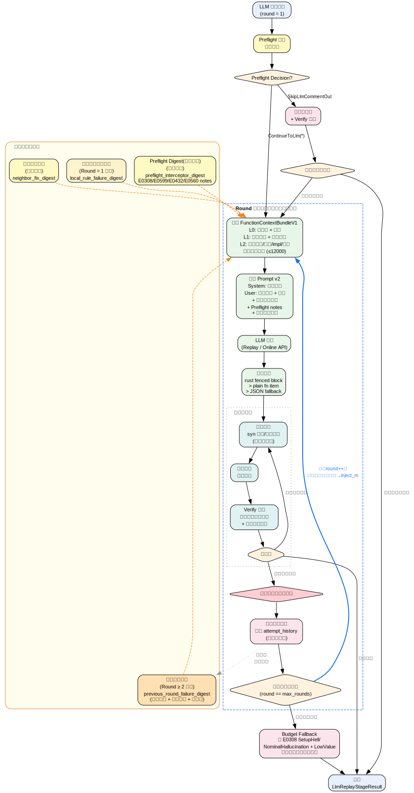

> 图表源文件：[docs/diagrams/04_llm_round_loop.dot](docs/diagrams/04_llm_round_loop.dot)

### 9.5 候选解析与验证

**候选解析**（`candidate_resolution.rs`）支持两种输入格式：

| 格式 | 来源 | 处理 |
|---|---|---|
| `patched_function_text` | LLM 返回完整函数文本 | AST 级“函数体嫁接”：仅覆盖原函数 `block`，签名/属性强制保留原函数 |
| `actions` （Legacy） | 旧格式动作数组 | 验证在**同测试模块范围内**或目标函数范围内 |

**签名/属性守卫**（`validate_signature_and_attrs_unchanged`）：
- 使用 `syn` 解析原始与候选函数
- `patched_function_text` 路径中先执行 AST 函数体合并，再校验“合并结果”与原函数签名/属性一致
- 该守卫用于兜底不变量检查，不再因候选遗漏属性而直接拒绝（属性来自原函数）

**作用域检验**（`validate_action_scope`）：
1. 调用 `FunctionIndex::enclosing_test_module_scope(function_id)` 确定诊断所在的测试模块范围
2. **允许的修改范围**：
   - 目标函数体内的修改
   - 同测试模块内的其他函数、`use` 导入、变量定义（用于 E0308 Nominal Drift）
   - **禁止**：生产代码、其他模块/文件的代码
3. 若诊断不在任何测试模块内（回退函数级），则仅允许目标函数体修改（向后兼容）

**验证（Verify）门禁**：
1. 将候选动作合并到当前计划
2. 在临时工作空间中编译
3. **接纳条件**：
   - 目标函数 unresolved 错误清零
   - **新增加**：同测试模块外不得出现新的 unresolved 错误（E0433/E0432/E0425）
   - 同测试模块内的其他函数可因迭代修复而变化，不构成回归
4. 通过即接纳，失败则丢弃进入下一候选

**Preflight Comment-Out 模块范围**：
- 若诊断落在测试模块范围，优先在模块层进行更细粒度的注释，降低误杀范围
- 回退：模块信息不可用时，退回到函数级注释

### 9.6 失败分类

| 失败码 | 触发场景 |
|---|---|
| `LLM_OUTPUT_INVALID_SCHEMA` | 输出无法解析为有效 Rust 函数 |
| `LLM_ACTION_OUT_OF_SCOPE` | 修复动作超出目标函数边界或签名被修改 |
| `LLM_ACTION_CONFLICT` | 修复动作与现有计划冲突 |
| `LLM_VERIFY_FAILED` | 编译验证未满足接纳条件 |
| `LLM_BUDGET_EXHAUSTED` | 所有轮次预算耗尽 |
| `FUNCTION_MAPPING_FAILED` | 函数 ID 无法映射到源文件 |
| `LLM_REQUEST_FAILED` | Online 模式 HTTP 请求失败（含超时） |
| `CONTEXT_TOO_LARGE` | 目标函数超出上下文硬上限 |

### 9.7 文本归一化

LLM 输出经过多步归一化：

1. `normalize_replay_text()`：去除首尾空白和 markdown 代码围栏
2. `normalize_with_rustfmt()`：尝试 `rustfmt` 格式化（失败不阻断）
3. `normalize_function_text()`：`syn` 函数项解析 + `rustfmt` 归一化
4. 对 `patched_function_text` 路径执行 AST 函数体合并：`prettyplease` 重建函数项文本后再次走 `rustfmt` 归一化

---

## 10. Coordinator 与 Transformer

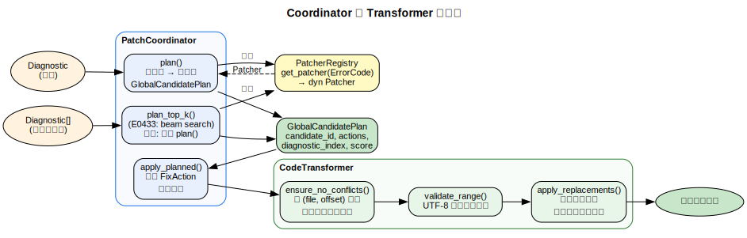

> 图表源文件：[docs/diagrams/11_coordinator_flow.dot](docs/diagrams/11_coordinator_flow.dot)

### 10.1 PatchCoordinator

```rust
pub struct PatchCoordinator {
    registry: PatcherRegistry,
}

pub struct GlobalCandidatePlan {
    pub candidate_id: String,
    pub plan: BTreeMap<PathBuf, Vec<FixAction>>,
    pub score: i32,
}
```

**职责**：
- `plan()`：为单个诊断生成最佳单候选修复计划
- `plan_top_k()`：为 E0433 使用 `analyze_top_k()` 生成 Top-K 候选（beam search）；其他错误码回退到 `plan()` 单候选
- `apply_planned()`：通过 `CodeTransformer` 应用 FixAction 到源文件
- 冲突检测通过 `CodeTransformer::ensure_no_conflicts()` 实现（按 file_path + byte_offset 排序）

### 10.2 CodeTransformer

```rust
pub struct CodeTransformer;
```

**核心方法**：
- `apply_replacements(source, actions)`：**从右到左**应用替换以保持字节偏移稳定
- `ensure_no_conflicts(actions)`：验证 FixAction 集合的字节范围无重叠
- `validate_range(span, source)`：UTF-8 字节边界校验

当前**仅支持** `FixAction::Replace`；遇到 `Insert`/`Delete` 返回 `UnsupportedFixAction` 错误。

---

## 11. 运行时工作流

### 11.1 Fix 模式完整流程

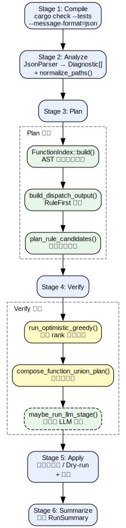

> 图表源文件：[docs/diagrams/05_fix_flow.dot](docs/diagrams/05_fix_flow.dot)

### 11.2 Optimistic Greedy 验证

`run_optimistic_greedy()` 对规则候选执行逐轮 rank 提升验证：

1. 初始每函数取 rank-0（最高分）候选
2. 合并为全局计划，提交编译验证
3. 若验证失败，识别冲突函数
4. 升级冲突函数的 rank（下一候选）
5. 重复直至验证通过或所有 rank 耗尽

### 11.3 Partial Union Plan

将已通过验证的函数计划合并（`compose_function_union_plan()`），形成：
- `resolved_function_ids`：规则成功修复的函数
- `unresolved_function_ids`：需移交 LLM 的函数
- 最终 diff 通过 `prepare_patch_stage()` 生成 unified diff 格式

### 11.4 退出码

| 退出码 | 含义 |
|---|---|
| 0 | 全部修复成功 |
| 3 | Apply 阶段失败 |
| 5 | 用法错误或 Artifact 缺失 |
| 7 | 部分函数待 LLM 处理 |

---

## 12. CLI 与配置系统

### 12.1 CLI 参数

```text
ruter [全局选项] <子命令>

全局选项:
  -v                        详细输出级别（可叠加）
  --apply                   实际写入修改（默认 dry-run）
  --no-backup               跳过备份（仅与 --apply 一起使用）
  --diff-file <PATH>        自定义 diff 输出路径
  --log-file <PATH>         日志文件路径
  --run-tests               验证时也执行 cargo test
  --artifacts-dir <PATH>    Artifact 输出目录
  --config <PATH>           自定义配置文件路径
  --topk <N>                Top-K 候选宽度（默认 3）
  --keep-updated-sources    保留更新后的源文件副本

LLM 选项:
  --enable-llm              启用 LLM 修复路径（默认关闭）
  --llm-mode <MODE>         replay | online
  --llm-replay-file <PATH>  Replay 模式数据文件
  --llm-api-url <URL>       Online 模式 API 地址
  --llm-model <MODEL>       LLM 模型名称
  --llm-timeout-secs <N>    请求超时（默认 60s）
  --llm-max-rounds <N>      每函数最大轮次（默认 3）
  --llm-max-candidates <N>  每轮最大候选数（默认 3）
  --llm-context-max-chars <N>   上下文字符预算（默认 12000）
  --llm-target-fn-hard-limit-chars <N>  函数体硬上限（默认 8000）
  --llm-raw-excerpt-max-chars <N>       原始响应截断
  --llm-debug-dump-full-io  输出完整 LLM I/O 到 artifact

子命令:
  fix <crate_path>                     一键修复
  step <stage> <crate_path>            逐步执行
    stage: compile | analyze | plan | verify | apply
```

### 12.2 配置优先级

```
CLI 参数 > 环境变量 (RUTER_*) > TOML 配置文件 > 默认值
```

**TOML 配置文件**（默认 `ruter.toml`）：

```toml
[topk]
size = 3

[llm]
enabled = false
mode = "replay"
timeout_secs = 60
max_rounds = 3
max_candidates_per_round = 3
raw_response_max_chars = 4096
debug_dump_full_io = false

[llm.context]
max_chars = 12000
target_fn_hard_limit_chars = 8000
```

**环境变量前缀**：`RUTER_`（映射如 `RUTER_LLM_MODE=online`）。API Key 仅通过环境变量 `RUTER_LLM_API_KEY` 传入，不支持 TOML/CLI。

### 12.3 配置解析结构

```rust
pub struct ResolvedConfig {
    pub topk_size: usize,           // 默认 3
    pub llm: ResolvedLlmConfig,
}

pub struct ResolvedLlmConfig {
    pub enabled: bool,              // 默认 false
    pub mode: LlmMode,             // 默认 Replay
    pub replay_file: Option<PathBuf>,
    pub api_url: Option<String>,
    pub model: Option<String>,
    pub api_key: Option<String>,
    pub timeout_secs: u64,          // 默认 60
    pub max_rounds: u8,             // 默认 3
    pub max_candidates_per_round: usize,  // 默认 3
    pub context_max_chars: usize,   // 默认 12000
    pub target_fn_hard_limit_chars: usize,  // 默认 8000
    pub raw_response_max_chars: usize,      // 默认 4096
    pub debug_dump_full_io: bool,   // 默认 false
    pub keep_updated_sources: bool,
}
```

---

## 13. Artifacts 可观测性体系

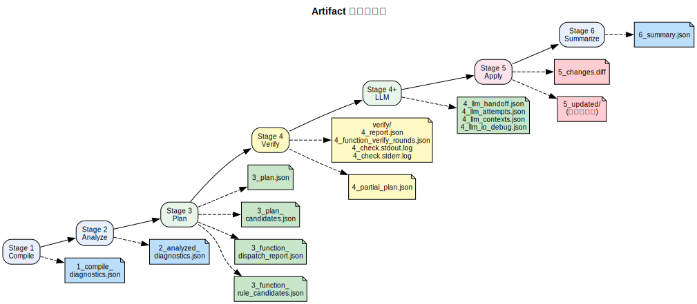

> 图表源文件：[docs/diagrams/12_artifact_timeline.dot](docs/diagrams/12_artifact_timeline.dot)

所有中间状态以编号 JSON 文件持久化到 `artifacts_dir`。

### 13.1 Artifact 文件清单

| 编号 | 文件名 | 内容 |
|---|---|---|
| 1 | `1_compile_diagnostics.json` | 原始编译 NDJSON 输出 |
| 2 | `2_analyzed_diagnostics.json` | 解析后的 `Diagnostic[]` |
| 3 | `3_plan.json` | 全局修复计划（文件 → 动作列表） |
| 3 | `3_plan_candidates.json` | Top-K 候选计划 |
| 3 | `3_function_dispatch_report.json` | 函数分发决策报告 |
| 3 | `3_function_rule_candidates.json` | 函数级规则候选 |
| 4 | `verify/4_report.json` | 验证报告 |
| 4 | `verify/4_function_verify_rounds.json` | 函数验证轮次历史 |
| 4 | `verify/4_check.stdout.log` | 验证编译 stdout |
| 4 | `verify/4_check.stderr.log` | 验证编译 stderr |
| 4 | `4_partial_plan.json` | Partial Union 计划 |
| 4 | `4_llm_handoff.json` | LLM 移交清单 |
| 4 | `4_llm_attempts.json` | LLM 尝试记录 |
| 4 | `4_llm_contexts.json` | LLM 上下文快照 |
| 4 | `4_llm_io_debug.json` | LLM I/O 调试（`--llm-debug-dump-full-io`） |
| 5 | `5_changes.diff` | Unified Diff 补丁 |
| 5 | `5_updated/` | 更新后的源文件副本（`--keep-updated-sources`） |
| 6 | `6_summary.json` | 运行汇总 |

### 13.2 RunSummary 结构

```rust
pub struct RunSummary {
    pub initial_compile_passed: bool,
    pub diagnostic_count: usize,
    pub initial_error_total: usize,
    pub initial_error_by_code: BTreeMap<String, usize>,
    pub remaining_error_total: usize,
    pub remaining_error_by_code: BTreeMap<String, usize>,
    pub planned_file_count: usize,
    pub planned_action_count: usize,
    pub patch_candidate_file_count: usize,
    pub patch_verify_check_passed: Option<bool>,
    pub patch_verify_tests_passed: Option<bool>,
    pub patch_applied: bool,
    pub applied_file_count: usize,
    pub diff_file: PathBuf,
    pub verify_report_file: PathBuf,
    pub topk_size: usize,
    pub topk_attempted: usize,
    pub topk_selected_candidate_id: Option<String>,
    pub topk_exhausted: bool,
    pub partial_pending_llm: bool,
    pub llm_handoff_count: usize,
    pub preflight_skipped_llm_count: usize,
    pub preflight_skipped_llm_by_code: BTreeMap<String, usize>,
    pub resolved_test_function_count: usize,
    pub unresolved_test_function_count: usize,
}
```

### 13.3 LLM Attempt Record

每轮候选尝试追加写入 `4_llm_attempts.json`：

- `phase`：执行阶段（`mapping` / `preflight_comment_out` / `preflight_budget_e0308` / `round_N`）
- `accepted`、`failure_kind`、`failure_detail`
- `prompt_excerpt`：User Prompt 摘录（调试用）
- `normalized_candidate`：LLM 输出归一化后的候选摘要
- `check_error_total` / `check_error_by_code`：验证后编译错误统计

---

## 14. 默认约束与安全边界

| 编号 | 约束 |
|---|---|
| 1 | 默认仅修改测试代码 |
| 2 | 默认仅修改目标函数作用域 |
| 3 | 默认关闭 LLM；开启后默认 Replay 模式 |
| 4 | 默认每函数 3 轮、每轮 3 候选预算；网络失败计入预算 |
| 5 | 执行端统一归一化到 `FixAction::Replace` |
| 6 | Round ≥ 2 默认注入上一轮失败记忆 |
| 7 | Round = 1 默认注入本地规则失败摘要 |
| 8 | LowValue 仅作为信号；是否注释由错误码感知 Preflight 决策确定 |
| 9 | 默认 Dry-run（不写回源文件），需 `--apply` 显式启用 |
| 10 | `--no-backup` 仅与 `--apply` 配合使用 |
| 11 | API Key 仅通过环境变量传入 |
| 12 | 文件路径在上下文中脱敏（`redact_file_path()`） |
| 13 | 临时工作空间用于验证，不污染原始 crate |

---

## 15. 附录：联网核对来源

1. Rust E0433 官方解释：<https://doc.rust-lang.org/error_codes/E0433.html>
2. Rust E0432 官方解释：<https://doc.rust-lang.org/error_codes/E0432.html>
3. Rust E0308 官方解释：<https://doc.rust-lang.org/error_codes/E0308.html>
4. Rust E0599 官方解释：<https://doc.rust-lang.org/error_codes/E0599.html>
5. Rust E0560 官方解释：<https://doc.rust-lang.org/error_codes/E0560.html>
6. Rust E0559 官方解释：<https://doc.rust-lang.org/error_codes/E0559.html>
7. Rust E0063 官方解释：<https://doc.rust-lang.org/error_codes/E0063.html>
8. Rust E0451 官方解释：<https://doc.rust-lang.org/error_codes/E0451.html>
9. Rust Type Coercions 规则：<https://doc.rust-lang.org/reference/type-coercions.html>
10. Rust struct expression 语法：<https://doc.rust-lang.org/reference/expressions/struct-expr.html>
11. rustc JSON 诊断格式：<https://doc.rust-lang.org/beta/rustc/json.html>
