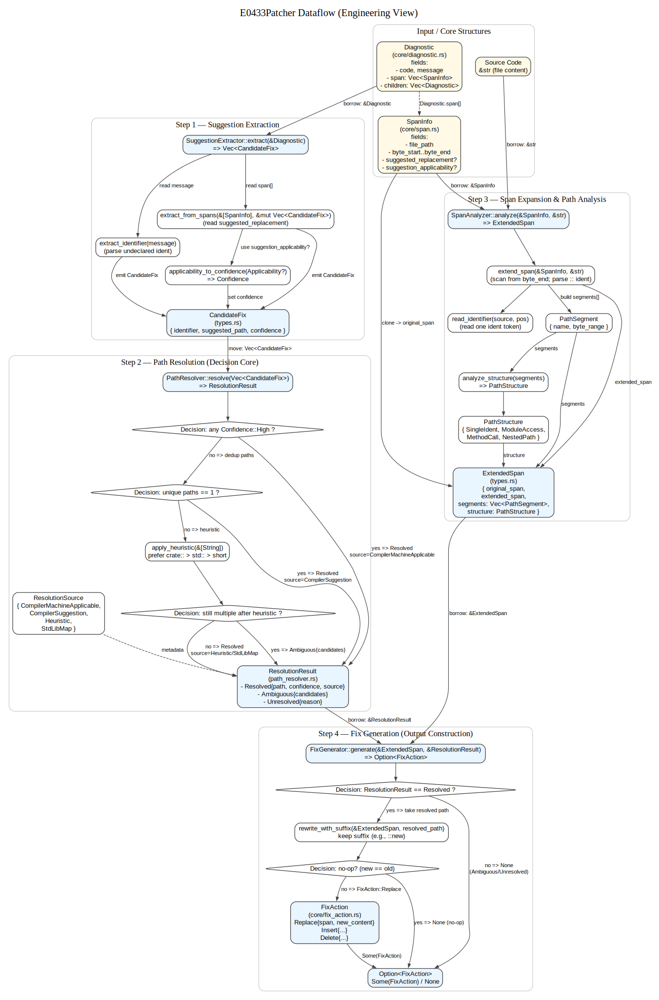
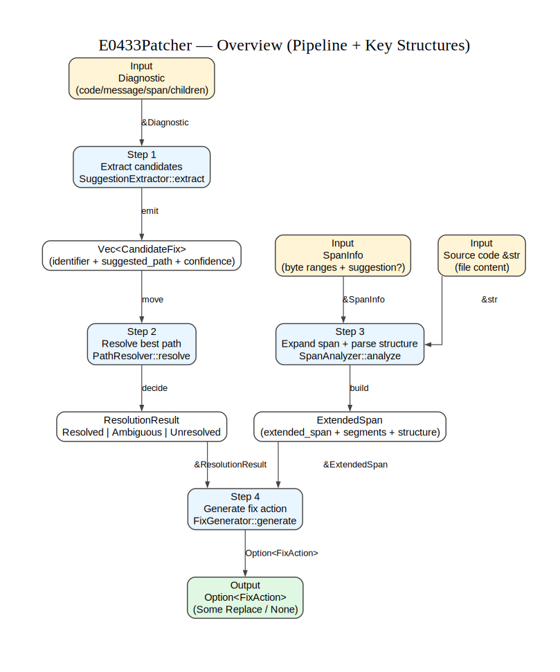
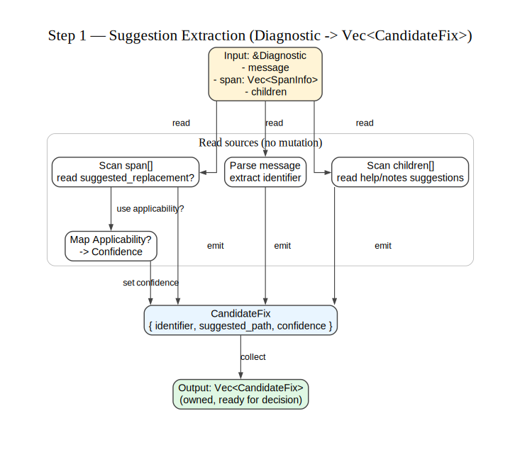
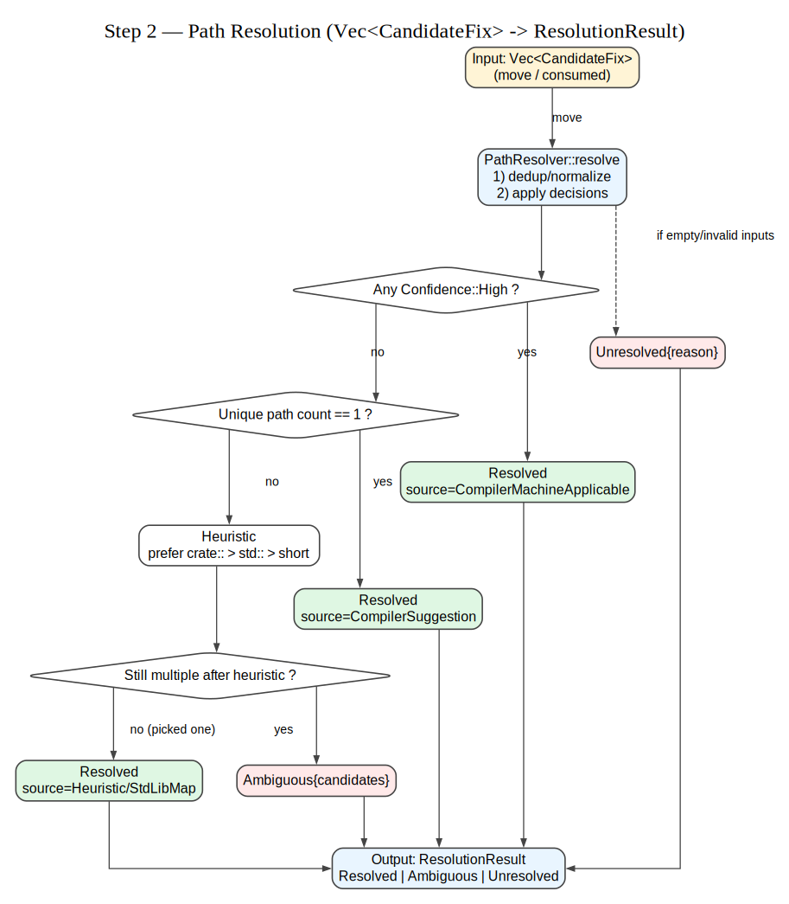
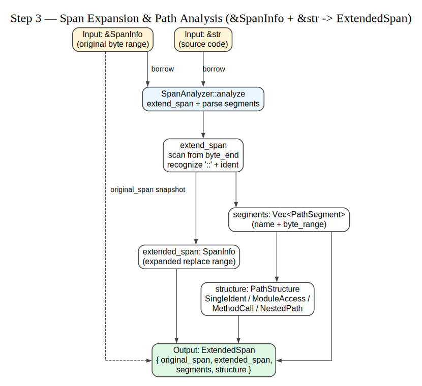
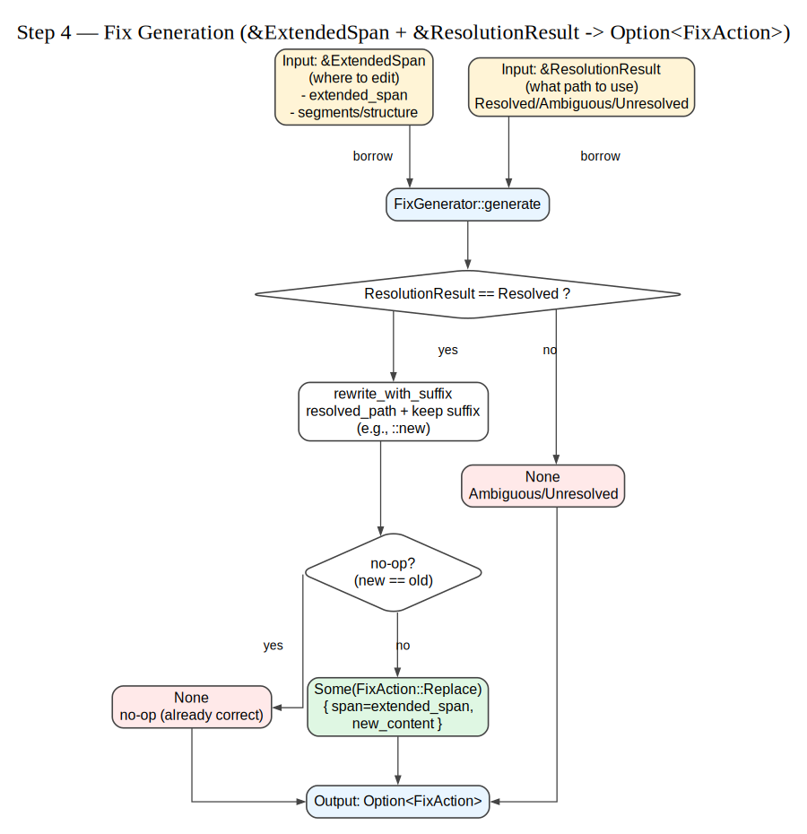

## E0433Patcher 模块数据结构分析文档

### 📚 教学目标

本文档从"Rust 学习者"视角出发，解释 E0433Patcher 模块中：
1. 每个数据结构的存在意义与职责
2. 数据如何在模块中流动（从输入到输出）
3. 函数之间的控制流关系
4. Rust 所有权机制在实际工程中的体现（借用 vs 消耗）

---

## 1️⃣ 数据结构分类与职责

### 1.1 核心数据结构（Core Data Structures）

这些结构定义了"问题域的语言"，它们来自编译器诊断信息，是整个修复流程的输入与输出。

#### 📦 `Diagnostic`（来自 core/diagnostic.rs）
```rust
pub struct Diagnostic {
    pub message_type: Option<String>,
    pub code: Option<CompilerCode>,
    pub message: String,
    pub span: Vec<SpanInfo>,
    pub severity: Severity,
    pub children: Vec<Diagnostic>,
    pub rendered: Option<String>,
}
```

**存在目的**：
- 表示 rustc JSON 诊断输出的结构化形式
- 是整个修复流程的**唯一入口数据**

**职责**：
- 承载错误码（如 E0433）
- 承载错误消息（如 "use of undeclared crate `serde`"）
- 承载位置信息（`span`）
- 承载编译器建议（`children` 中的 `help` 类型诊断）

**如果没有它会怎样**：
- 无法从编译器获取结构化错误信息
- 只能解析文本输出（极易出错，难以维护）

**在模块中的角色**：
- **只读输入**：整个 E0433 模块只读取 `Diagnostic`，从不修改它

---

#### 📍 `SpanInfo`（来自 core/span.rs）
```rust
pub struct SpanInfo {
    pub file_path: PathBuf,
    pub byte_start: usize,
    pub byte_end: usize,
    pub line_start: usize,
    pub line_end: usize,
    pub col_start: usize,
    pub col_end: usize,
    pub is_primary: bool,
    pub suggested_replacement: Option<String>,
    pub suggestion_applicability: Option<Applicability>,
    // ...
}
```

**存在目的**：
- 精确定位源码中的"错误位置"或"建议位置"
- 包含字节偏移、行列号、建议替换文本等

**职责**：
- 告诉你"问题在哪"（字节范围 `byte_start..byte_end`）
- 告诉你"编译器建议替换成什么"（`suggested_replacement`）
- 告诉你"这个建议可靠吗"（`suggestion_applicability`）

**如果没有它会怎样**：
- 无法知道要修复代码的哪一行哪一列
- 无法生成精确的代码替换动作

**在模块中的角色**：
- **只读输入**：来自 `Diagnostic.span` 
- **克隆扩展**：`SpanAnalyzer` 会克隆它并扩展为 `ExtendedSpan`

---

#### 🔧 `FixAction`（来自 core/fix_action.rs）
```rust
pub enum FixAction {
    Replace { span: SpanInfo, new_content: String },
    Insert { span: SpanInfo, content: String },
    Delete { span: SpanInfo },
}
```

**存在目的**：
- 表示"如何修复代码"的抽象指令
- 是 E0433Patcher 的**唯一输出数据**

**职责**：
- 封装"在哪里"（`span`）和"改成什么"（`new_content`）
- 可被后续的 `CodeTransformer` 应用到文件

**如果没有它会怎样**：
- 修复器只能输出字符串建议，无法被自动化工具应用
- 无法表达"在哪个文件的哪个位置做什么操作"

**在模块中的角色**：
- **最终产出**：由 `FixGenerator::generate()` 构造并返回

---

### 1.2 E0433 专用数据结构（Domain-Specific Structures）

这些结构只为 E0433 错误（"未声明的 crate/module/type"）设计，它们将编译器诊断"翻译"成更高层的领域概念。

#### 🎯 `CandidateFix`（来自 patchers/e0433/types.rs）
```rust
pub struct CandidateFix {
    pub bare_identifier: String,          // e.g., "HashMap"
    pub suggested_path: String,      // e.g., "std::collections::HashMap"
    pub confidence: Confidence,      // High / Medium / Low
}
```

**存在目的**：
- 表示"一个可能的修复候选"
- 从编译器建议中提取的"最小可操作信息"

**职责**：
- 承载编译器建议的路径（如 `std::collections::HashMap`）
- 关联未声明的标识符（如 `HashMap`）
- 携带可信度等级（用于后续排序选择）

**如果没有它会怎样**：
- 必须在每个函数中重复解析 `Diagnostic` 的结构
- 无法在"提取建议"和"选择建议"之间解耦

**在模块中的角色**：
- **中间数据**：由 `SuggestionExtractor` 生成，传递给 `PathResolver`
- **只读借用**：`PathResolver::resolve()` 消耗 `Vec<CandidateFix>`（move）

---

#### 🔍 `ExtendedSpan`（来自 patchers/e0433/types.rs）
```rust
pub struct ExtendedSpan {
    pub original_span: SpanInfo,      // 编译器报告的原始 span
    pub extended_span: SpanInfo,      // 扩展后的 span（覆盖完整路径）
    pub segments: Vec<PathSegment>,   // 路径分段，如 ["State", "new"]
    pub structure: PathStructure,     // 路径类型（单标识符 / 模块访问 / 方法调用）
}
```

**存在目的**：
- 编译器报告的 span 可能只覆盖部分代码（如 `State`），而实际代码是 `State::new()`
- 需要"向后扫描"完整路径，才能正确替换

**职责**：
- 扩展 span 以覆盖完整路径（如 `State::new`）
- 解析路径结构（是单个标识符还是模块路径？是否是方法调用？）
- 提供精确的字节范围（`PathSegment.byte_range`）用于精确替换

**如果没有它会怎样**：
- 只能替换编译器报告的部分代码，导致语法错误
  - 例如：将 `State::new()` 中的 `State` 替换为 `crate::foo::State`，结果是 `crate::foo::State::new()`（正确）
  - 但如果只替换原始 span，可能变成 `crate::foo::State::new()`（错误）

**在模块中的角色**：
- **中间数据**：由 `SpanAnalyzer` 生成，传递给 `FixGenerator`
- **只读借用**：`FixGenerator::generate()` 借用 `&ExtendedSpan`

---

#### 🧩 `PathSegment`（来自 patchers/e0433/types.rs）
```rust
pub struct PathSegment {
    pub name: String,                  // 路径片段名称，如 "State"
    pub byte_range: Range<usize>,      // 在源码中的字节范围
}
```

**存在目的**：
- 表示路径的一个"片段"（如 `State::new` 中的 `State` 和 `new`）
- 携带精确的字节位置，用于后续的代码替换

**职责**：
- 记录路径片段的名称与位置
- 支持"保留后缀"逻辑（如 `State::new` 中保留 `::new`）

**如果没有它会怎样**：
- 无法区分路径的不同部分（无法判断哪部分是"要替换的"，哪部分是"要保留的"）
- 无法实现精确的字节范围替换

**在模块中的角色**：
- **组成部分**：是 `ExtendedSpan.segments` 的元素
- **只读借用**：被 `FixGenerator` 用于构造新路径

---

#### 📊 `PathStructure`（来自 patchers/e0433/types.rs）
```rust
pub enum PathStructure {
    SingleIdent,      // 如 `State`
    ModuleAccess,     // 如 `foo::Bar`
    MethodCall,       // 如 `State::new()`
    NestedPath,       // 如 `a::b::c::Item`
}
```

**存在目的**：
- 对路径进行分类，帮助做出更智能的修复决策
- 记录"语义信息"（是模块访问还是方法调用？）

**职责**：
- 标记路径的"结构类型"
- 用于未来扩展（如对方法调用采用不同的修复策略）

**如果没有它会怎样**：
- 无法区分 `State::new` 是"静态方法调用"还是"模块路径"
- 可能生成不合理的修复建议

**在模块中的角色**：
- **元数据**：附加在 `ExtendedSpan` 上，当前版本主要用于调试和未来扩展

---

#### 🏆 `Confidence`（来自 patchers/e0433/types.rs）
```rust
pub enum Confidence {
    Low,
    Medium,
    High,
}
```

**存在目的**：
- 表示修复建议的"可信度"
- 源自编译器的 `Applicability`（如 `MachineApplicable` → `High`）

**职责**：
- 用于排序和选择最佳修复候选
- 传递给 `FixAction`（未来可用于用户确认流程）

**如果没有它会怎样**：
- 无法区分"编译器确认可用"和"编译器不确定"的建议
- 可能应用低质量的修复导致新错误

**在模块中的角色**：
- **元数据**：附加在 `CandidateFix` 和 `ResolutionResult` 上
- **复制类型**：`Copy` trait，传递时不消耗所有权

---

### 1.3 中间结果结构（Intermediate Result Structures）

#### 🎲 `ResolutionResult`（来自 patchers/e0433/path_resolver.rs）
```rust
pub enum ResolutionResult {
    Resolved { path: String, confidence: Confidence, source: ResolutionSource },
    Ambiguous { candidates: Vec<String> },
    Unresolved { reason: String },
}
```

**存在目的**：
- 表示"路径解析"的三种可能结果：
  1. 成功解析（`Resolved`）
  2. 有多个候选但无法确定（`Ambiguous`）
  3. 无法解析（`Unresolved`）

**职责**：
- 封装 `PathResolver` 的决策结果
- 携带解析来源信息（编译器建议 vs 启发式规则）

**如果没有它会怎样**：
- 只能返回 `Option<String>`，无法表达"为什么失败"
- 无法区分"有多个候选"和"没有候选"

**在模块中的角色**：
- **中间结果**：由 `PathResolver` 返回，传递给 `FixGenerator`
- **只读借用**：`FixGenerator::generate()` 借用 `&ResolutionResult`

---

#### 🏷️ `ResolutionSource`（来自 patchers/e0433/path_resolver.rs）
```rust
pub enum ResolutionSource {
    CompilerMachineApplicable,
    CompilerSuggestion,
    Heuristic,
    StdLibMap,
}
```

**存在目的**：
- 记录"这个路径是怎么来的"
- 用于调试和未来的置信度调整

**职责**：
- 标记路径来源（编译器 vs 启发式规则）
- 用于未来的"解释性输出"（告诉用户为什么选择这个路径）

**如果没有它会怎样**：
- 无法追溯修复建议的来源
- 难以调试"为什么选择了这个路径"

**在模块中的角色**：
- **元数据**：附加在 `ResolutionResult::Resolved` 上
- **复制类型**：`Copy` trait

---

## 2️⃣ 数据流动分析（Data Flow）

### 2.1.1 完整数据流图



### 2.1.2 总览图


### 2.1.3 分步图










---

### 2.2 分步解析（每一步发生了什么）

#### 步骤 1：提取候选修复（`SuggestionExtractor::extract`）

**输入**：`&Diagnostic`（只读借用）

**处理过程**：
1. 从 `diagnostic.message` 提取未声明的标识符（如 `"serde"`）
2. 遍历 `diagnostic.span`，查找 `suggested_replacement`
3. 遍历 `diagnostic.children`（help 消息），查找更多建议
4. 将每个建议转换为 `CandidateFix`，包含路径和可信度

**输出**：`Vec<CandidateFix>`（拥有所有权）

**关键函数调用**：
- `extract_identifier()` — 从消息提取标识符
- `extract_from_spans()` — 从 span 提取建议
- `applicability_to_confidence()` — 转换可应用性为可信度

**Rust 所有权特性**：
- 输入是**只读借用** `&Diagnostic`，不消耗原始数据
- 输出是**新分配**的 `Vec<CandidateFix>`，调用者获得所有权

---

#### 步骤 2：解析路径（`PathResolver::resolve`）

**输入**：`Vec<CandidateFix>`（消耗所有权，move）

**处理过程**：
1. 检查是否有 `Confidence::High` 的候选（编译器确认可用）→ 直接返回
2. 收集所有唯一路径，去重
3. 如果只有一个唯一路径 → 返回
4. 如果有多个路径 → 应用启发式规则（prefer `crate::` > `std::` > 短路径）
5. 如果仍然有多个候选 → 返回 `Ambiguous`

**输出**：`ResolutionResult`（拥有所有权）

**关键函数调用**：
- `apply_heuristic()` — 启发式排序选择

**Rust 所有权特性**：
- 输入是**消耗**（move），因为不需要再使用 `Vec<CandidateFix>`
- 输出是**新分配**的 `ResolutionResult`

---

#### 步骤 3：扩展 span（`SpanAnalyzer::analyze`）

**输入**：
- `&SpanInfo`（只读借用）
- `&str`（源码字符串，只读借用）

**处理过程**：
1. 从 `original_span.byte_end` 开始向后扫描
2. 识别 `::` 分隔符和标识符
3. 构造 `PathSegment`（包含名称和字节范围）
4. 判断路径结构（`SingleIdent` / `ModuleAccess` / `MethodCall` / `NestedPath`）
5. 构造新的 `SpanInfo`（扩展后的字节范围）

**输出**：`ExtendedSpan`（拥有所有权）

**关键函数调用**：
- `extend_span()` — 扩展 span 并提取路径片段
- `analyze_structure()` — 判断路径结构类型
- `read_identifier()` — 读取标识符（辅助函数）

**Rust 所有权特性**：
- 输入是**只读借用** `&SpanInfo`，不消耗原始数据
- 输出是**新分配**的 `ExtendedSpan`（包含克隆的 `original_span`）

---

#### 步骤 4：生成修复动作（`FixGenerator::generate`）

**输入**：
- `&ExtendedSpan`（只读借用）
- `&ResolutionResult`（只读借用）

**处理过程**：
1. 从 `ResolutionResult` 中提取已解析的路径（如 `crate::foo::State`）
2. 从 `ExtendedSpan.segments` 中找到与已解析路径尾部匹配的片段
3. 构造新路径（保留后缀，如 `crate::foo::State::new`）
4. 检查是否是 no-op（新旧路径相同）→ 返回 `None`
5. 构造 `FixAction::Replace`

**输出**：`Option<FixAction>`（拥有所有权）

**关键函数调用**：
- `rewrite_with_suffix()` — 重写路径并保留后缀

**Rust 所有权特性**：
- 输入是**只读借用**，不消耗原始数据
- 输出是**新分配**的 `Option<FixAction>`

---

## 3️⃣ 控制流程的关键节点

### 3.1 关键函数列表

| 函数 | 职责 | 输入 | 输出 | 是否关键节点 |
|------|------|------|------|------------|
| `SuggestionExtractor::extract` | 从诊断中提取候选修复 | `&Diagnostic` | `Vec<CandidateFix>` | ✅ 是（流程起点） |
| `PathResolver::resolve` | 从候选中选择最佳路径 | `Vec<CandidateFix>` | `ResolutionResult` | ✅ 是（决策核心） |
| `SpanAnalyzer::analyze` | 扩展 span 并分析路径 | `&SpanInfo`, `&str` | `ExtendedSpan` | ✅ 是（结构分析） |
| `FixGenerator::generate` | 生成最终修复动作 | `&ExtendedSpan`, `&ResolutionResult` | `Option<FixAction>` | ✅ 是（输出生成） |
| `extract_from_spans` | 辅助：从 span 列表提取建议 | `&[SpanInfo]`, `&mut Vec<CandidateFix>` | - | ❌ 辅助函数 |
| `applicability_to_confidence` | 辅助：转换可应用性为可信度 | `Option<Applicability>` | `Confidence` | ❌ 辅助函数 |
| `apply_heuristic` | 辅助：启发式排序 | `&[String]` | `Option<String>` | ⚠️ 半关键（决策逻辑） |
| `extend_span` | 辅助：扩展 span | `&SpanInfo`, `&str` | `(SpanInfo, Vec<PathSegment>)` | ⚠️ 半关键（核心算法） |
| `rewrite_with_suffix` | 辅助：重写路径保留后缀 | `&ExtendedSpan`, `&str` | `String` | ⚠️ 半关键（输出构造） |

---

### 3.2 控制流程图（Call Graph）

```
main (E0433Patcher 主流程，待实现)
│
├─▶ SuggestionExtractor::extract(&diagnostic)
│   ├─▶ extract_identifier(&message)
│   ├─▶ extract_from_spans(&spans, ...)
│   │   └─▶ applicability_to_confidence(...)
│   └─▶ extract_path_from_message(&message)
│
├─▶ SpanAnalyzer::analyze(&span, source_code)
│   ├─▶ extend_span(&span, source_code)
│   │   └─▶ read_identifier(source, pos)
│   └─▶ analyze_structure(&segments, ...)
│
├─▶ PathResolver::resolve(candidates)
│   └─▶ apply_heuristic(&paths)
│
└─▶ FixGenerator::generate(&extended, &resolution)
    └─▶ rewrite_with_suffix(&extended, path)
```

---

## 4️⃣ Rust 所有权机制在数据流中的体现

### 4.1 只读借用（`&T`）

**定义**：借用数据的只读访问权，不消耗所有权，多个借用可同时存在。

**在模块中的使用**：

| 数据 | 函数 | 原因 |
|------|------|------|
| `&Diagnostic` | `SuggestionExtractor::extract` | 不需要修改诊断数据，只读取信息 |
| `&SpanInfo` | `SpanAnalyzer::analyze` | 不需要修改原始 span，只扩展新的 |
| `&ExtendedSpan` | `FixGenerator::generate` | 不需要修改扩展结果，只读取构造输出 |
| `&ResolutionResult` | `FixGenerator::generate` | 不需要修改解析结果，只读取路径 |
| `&str` | `SpanAnalyzer::analyze` | 源码只需要读取，不需要修改 |

**教学要点**：
- 只读借用是 Rust 最常用的参数传递方式
- 适用于"我只需要看看数据，不需要改它"的场景
- 多个函数可以同时借用同一数据（如多次调用 `analyze` 借用同一个 `&SpanInfo`）

---

### 4.2 可变借用（`&mut T`）

**定义**：借用数据的读写访问权，不消耗所有权，但同一时刻只能有一个可变借用。

**在模块中的使用**：

| 数据 | 函数 | 原因 |
|------|------|------|
| `&mut Vec<CandidateFix>` | `extract_from_spans` | 需要向 `candidates` 中追加新元素 |

**教学要点**：
- 可变借用用于"需要修改数据，但不需要拥有它"的场景
- 例如：`extract_from_spans` 需要向 `candidates` 中追加元素，但不需要获得整个 `Vec` 的所有权
- 这样可以在多次调用 `extract_from_spans` 时共享同一个 `Vec`，避免频繁分配内存

---

### 4.3 消耗所有权（move）

**定义**：将数据的所有权转移给函数，调用后原变量不可再使用。

**在模块中的使用**：

| 数据 | 函数 | 原因 |
|------|------|------|
| `Vec<CandidateFix>` | `PathResolver::resolve` | 不需要再使用候选列表，可以消耗以避免克隆 |

**教学要点**：
- 消耗所有权适用于"这个数据我用完就不需要了"的场景
- 例如：`PathResolver::resolve` 消耗 `Vec<CandidateFix>` 后返回 `ResolutionResult`，调用者不再需要访问原始候选列表
- 相比于借用后克隆（`resolve(&candidates)` 内部 `candidates.clone()`），直接消耗更高效

---

### 4.4 返回所有权（返回值）

**定义**：函数构造新数据并返回，调用者获得所有权。

**在模块中的使用**：

| 函数 | 返回值 | 原因 |
|------|--------|------|
| `SuggestionExtractor::extract` | `Vec<CandidateFix>` | 新构造的候选列表，调用者需要使用 |
| `SpanAnalyzer::analyze` | `ExtendedSpan` | 新构造的扩展结果，调用者需要使用 |
| `PathResolver::resolve` | `ResolutionResult` | 新构造的解析结果，调用者需要使用 |
| `FixGenerator::generate` | `Option<FixAction>` | 新构造的修复动作，调用者需要使用 |

**教学要点**：
- 函数通常"拥有"它构造的数据，并通过返回值将所有权转移给调用者
- 调用者可以自由决定是否进一步传递所有权（move）或借用（`&`）

---

## 5️⃣ 常见问题与设计决策

### Q1：为什么 `PathResolver::resolve` 消耗 `Vec<CandidateFix>` 而不是借用？

**A**：因为解析后不再需要原始候选列表，消耗所有权可以避免不必要的克隆。如果使用 `&Vec<CandidateFix>`，函数内部需要 `candidates.clone()` 才能排序和去重，浪费内存。

---

### Q2：为什么 `ExtendedSpan` 包含两个 `SpanInfo`（`original_span` 和 `extended_span`）？

**A**：
- `original_span`：记录编译器报告的原始位置，用于调试和错误追溯
- `extended_span`：记录扩展后的完整路径位置，用于代码替换

两者都需要保留，因为：
1. 调试时需要知道"编译器报告的是哪里"
2. 替换时需要知道"完整路径覆盖哪里"

---

### Q3：为什么 `FixGenerator::generate` 返回 `Option<FixAction>` 而不是 `Result<FixAction, Error>`？

**A**：因为"无法生成修复"不是"错误"，而是"正常的可能结果"：
- `ResolutionResult::Ambiguous` → 有多个候选，人工决策 → 返回 `None`
- `ResolutionResult::Unresolved` → 无候选 → 返回 `None`
- 新旧路径相同（no-op）→ 返回 `None`

这些都不是"异常情况"，所以用 `Option` 而不是 `Result`。

---

### Q4：为什么 `PathSegment` 包含 `byte_range` 而不是 `line/col`？

**A**：因为代码替换需要**字节精确**的位置：
- 字符串索引基于字节（`&str[start..end]`）
- 行列号是人类可读的，但不适合程序化操作
- `byte_range` 可以直接用于字符串切片，无需额外计算

---

## 6️⃣ 总结：数据结构的"存在意义"

| 数据结构 | 职责 | 如果没有它 |
|---------|------|-----------|
| `Diagnostic` | 承载编译器诊断 | 无法从编译器获取结构化错误 |
| `SpanInfo` | 精确定位代码位置 | 无法知道要修复哪里 |
| `FixAction` | 封装修复指令 | 无法自动化应用修复 |
| `CandidateFix` | 表示修复候选 | 必须在每个函数中重复解析诊断 |
| `ExtendedSpan` | 扩展完整路径 | 只能替换部分代码，导致语法错误 |
| `PathSegment` | 记录路径片段与位置 | 无法精确替换和保留后缀 |
| `PathStructure` | 标记路径类型 | 无法区分方法调用和模块路径 |
| `Confidence` | 标记可信度 | 无法区分高低质量建议 |
| `ResolutionResult` | 封装解析结果 | 无法表达"为什么失败" |
| `ResolutionSource` | 记录解析来源 | 无法追溯修复建议来源 |

---

## 7️⃣ 下一步学习建议

1. **手动实现 `E0433Patcher` 主流程**：
   - 创建 `src/patchers/e0433/patcher.rs`
   - 串联 `SuggestionExtractor` → `PathResolver` → `SpanAnalyzer` → `FixGenerator`
   - 实现 `Patcher` trait 的 `can_handle` 和 `generate_fixes` 方法

2. **编写集成测试**：
   - 准备真实的 rustc JSON 诊断样本
   - 测试完整流程（从诊断到修复动作）

3. **调试与优化**：
   - 使用 `cargo test --nocapture` 打印中间数据
   - 观察数据在流程中的变化

---

**文档完成时间**：2026年2月8日  
**目标读者**：Rust 初学者（理解基本语法和所有权机制）  
**学习目标**：理解数据结构设计、数据流动、所有权机制在工程中的应用